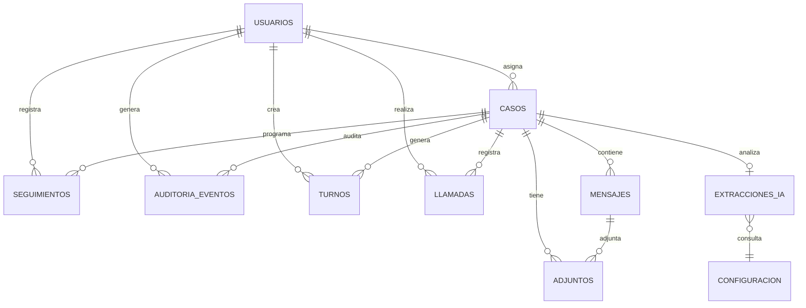
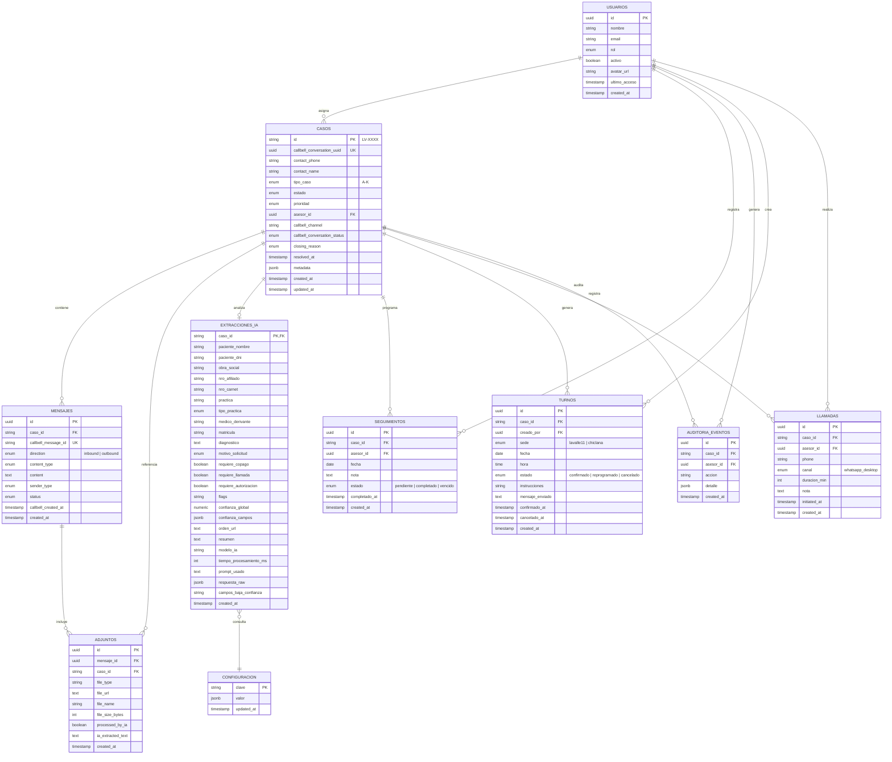

# DATABASE SCHEMA — Modelo de Datos Definitivo

> **Proyecto:** Panel de Gestión de Turnos con IA — Instituto Lavalle 11
> **Última actualización:** 2026-06-09
> **Motor:** PostgreSQL 15 (Supabase)
> **Audiencia:** Database Architects, Backend Developers
> **Propósito:** Diseño definitivo del modelo de datos. Aprobación previa a la creación de migraciones SQL.
>
> ⚠️ **Este documento NO contiene SQL.** Es la especificación de diseño conceptual.
> ⚠️ **Este documento NO contiene código.** Solo definiciones de entidades, relaciones y reglas.

---

## 0. Conventions & Notación

| Notación | Significado |
|---|---|
| `PK` | Primary Key |
| `FK → tabla` | Foreign Key referenciando otra tabla |
| `✅` | Campo obligatorio (NOT NULL) |
| `❌` | Campo opcional (nullable) |
| `🔷` | Campo que es **ENUM** |
| `🔄` | Default automático (`now()`, secuencia, trigger) |

**Origen de datos — cada campo se marca con:**

| Icono | Origen | Descripción |
|---|---|---|
| 📞 | **Callbell** | Dato que llega en el webhook de Callbell CRM |
| 🤖 | **IA (Claude)** | Dato extraído o inferido por Claude API |
| 👤 | **Asesor** | Dato ingresado manualmente por el asesor en el panel |
| ⚙️ | **Sistema** | Dato generado automáticamente (timestamps, secuencias, triggers) |

---

## 1. Diagrama Entidad-Relación



### Resumen de cardinalidades

| Entidad A | Cardinalidad | Entidad B | Regla de negocio |
|---|---|---|---|
| `casos` | 1 → N | `mensajes` | Una conversación tiene muchos mensajes |
| `mensajes` | 1 → N | `adjuntos` | Un mensaje puede tener 0 o más archivos adjuntos |
| `casos` | 1 → 1 | `extracciones_ia` | Cada caso tiene exactamente un análisis de IA |
| `casos` | 1 → N | `seguimientos` | Un caso puede tener 0 o más seguimientos programados |
| `casos` | 1 → N | `turnos` | Un caso puede generar 0 o más turnos (historial) |
| `casos` | 1 → N | `auditoria_eventos` | Cada acción sobre un caso genera un evento |
| `casos` | 1 → N | `llamadas` | Un caso puede tener 0 o más llamadas registradas |
| `casos` | N → 1 | `usuarios` | Un caso es gestionado por un asesor (nullable) |
| `usuarios` | 1 → N | `turnos` | Un usuario puede crear muchos turnos |
| `usuarios` | 1 → N | `seguimientos` | Un usuario puede programar muchos seguimientos |
| `usuarios` | 1 → N | `llamadas` | Un usuario puede registrar muchas llamadas |
| `usuarios` | 1 → N | `auditoria_eventos` | Un usuario genera eventos de auditoría |

---

## 2. ENUMs del Sistema

### 2.1 ENUMs de Casos

| ENUM | Valores | Se usa en | Propósito |
|---|---|---|---|
| `tipo_caso` | `A, B, C, D, E, F, G, H, I, J, K` | `casos.tipo_caso` | Clasificación del PRD (11 tipos) |
| `estado_caso` | `pendiente, en_proceso, esperando_respuesta, cerrado` | `casos.estado` | Máquina de estados del caso |
| `prioridad_caso` | `urgente, normal, bajo` | `casos.prioridad` | Prioridad visual en el panel |
| `closing_reason` | `turno_asignado, turno_reprogramado, turno_cancelado, consulta_resuelta, consulta_resuelta_portal, esperando_respuesta, derivado_chiclana, practica_no_disponible, equivocado, error_datos_ris, presupuesto_pendiente, sin_resolucion` | `casos.closing_reason` | Razón de cierre del caso (12 valores) |
| `callbell_conversation_status` | `opened, closed, pending` | `casos.callbell_conversation_status` | Estado de la conversación en Callbell |

### 2.2 ENUMs de Mensajes

| ENUM | Valores | Se usa en | Propósito |
|---|---|---|---|
| `direccion_mensaje` | `inbound, outbound` | `mensajes.direction` | Mensaje entrante (paciente) o saliente (sistema) |
| `tipo_contenido` | `text, image, document, audio, video, sticker` | `mensajes.content_type` | Tipo de contenido del mensaje |
| `tipo_remitente` | `patient, asesor, system` | `mensajes.sender_type` | Quién envió el mensaje |
| `estado_mensaje` | `received, sent, failed, delivered, read` | `mensajes.status` | Estado del mensaje en Callbell |

### 2.3 ENUMs de Turnos

| ENUM | Valores | Se usa en | Propósito |
|---|---|---|---|
| `sede_turno` | `lavalle11, chiclana` | `turnos.sede` | Sede del instituto |
| `estado_turno` | `confirmado, reprogramado, cancelado` | `turnos.estado` | Estado del turno |

### 2.4 ENUMs de Llamadas

| ENUM | Valores | Se usa en | Propósito |
|---|---|---|---|
| `canal_llamada` | `whatsapp_desktop` | `llamadas.canal` | Canal usado para la llamada. Único por ahora (wa.me/) |

### 2.5 ENUMs de Extracción IA

| ENUM | Valores | Se usa en | Propósito |
|---|---|---|---|
| `tipo_practica` | `ecografia, ecocardiograma, mamografia, densitometria, radiografia, espinografia, panoramica_dental, tac_cone_beam, puncion, biopsia, marcacion, traumatologia, ozonoterapia, pet_ct, spect_ct, centellograma, perfusion_miocardica, camara_gamma, otro` | `extracciones_ia.tipo_practica` | Catálogo de prácticas (19 tipos) |
| `motivo_solicitud` | `screening, busqueda, control, otro` | `extracciones_ia.motivo_solicitud` | Motivo de la orden médica |

### 2.6 ENUMs de Usuarios

| ENUM | Valores | Se usa en | Propósito |
|---|---|---|---|
| `rol_usuario` | `asesor, administrador` | `usuarios.rol` | Roles del sistema |

### 2.7 ENUMs de Seguimientos

| ENUM | Valores | Se usa en | Propósito |
|---|---|---|---|
| `estado_seguimiento` | `pendiente, completado, vencido` | `seguimientos.estado` | Estado del seguimiento |

### 2.8 ENUM de Flags

Los flags son un array de strings (`TEXT[]`) en `extracciones_ia.flags`. Valores permitidos:

| Flag | Significado | Origen |
|---|---|---|
| `ayuno` | Requiere ayuno previo al estudio | 🤖 IA |
| `aines` | Debe suspender AINEs | 🤖 IA |
| `orden_incompleta` | La orden médica tiene campos faltantes | 🤖 IA |
| `baja_confianza` | Score de confianza IA < 0.7 | ⚙️ Sistema |
| `token_ioma` | Paciente de IOMA — requiere token de app | ⚙️ Sistema (regla BR-06) |
| `chiclana` | Práctica de Medicina Nuclear — derivar a Chiclana | ⚙️ Sistema (regla BR-03) |
| `copago` | La obra social requiere copago | ⚙️ Sistema (vs Google Sheets) |
| `requiere_llamada` | Requiere llamada de verificación | ⚙️ Sistema (vs Google Sheets) |
| `orden_ilegible` | La imagen de la orden no pudo leerse | 🤖 IA |
| `error_ia` | Claude API falló o devolvió datos inválidos | ⚙️ Sistema |
| `contacto_recurrente` | El número de teléfono tiene casos previos | ⚙️ Sistema (regla BR-07) |

---

## 3. Tabla: `usuarios`

> Asesores y administradores del sistema. Vinculada 1:1 con `auth.users` de Supabase.

### Propósito

Almacena el perfil de cada usuario del sistema. Se sincroniza automáticamente con Supabase Auth mediante un trigger: cuando se crea un usuario en `auth.users`, se inserta un registro en `usuarios` con rol `asesor` por defecto.

### Campos

| Campo | Tipo | Obligatorio | Origen | Descripción |
|---|---|---|---|---|
| `id` | `UUID` | ✅ Sí 🔄 | ⚙️ Sistema | PK. Hereda de `auth.users.id` de Supabase |
| `nombre` | `VARCHAR(150)` | ✅ Sí | 👤 Admin | Nombre completo del usuario |
| `email` | `VARCHAR(255)` | ✅ Sí | ⚙️ Sistema | Email único. Usado para login. Heredado de auth |
| `rol` | `🔷 rol_usuario` | ✅ Sí | 👤 Admin | `asesor` o `administrador`. Default: `asesor` |
| `activo` | `BOOLEAN` | ✅ Sí | 👤 Admin | Si la cuenta está activa. Default: `true` |
| `avatar_url` | `TEXT` | ❌ No | 👤 Admin | URL del avatar (opcional) |
| `ultimo_acceso` | `TIMESTAMPTZ` | ❌ No | ⚙️ Sistema | Último login registrado |
| `created_at` | `TIMESTAMPTZ` | ✅ Sí 🔄 | ⚙️ Sistema | Default: `now()` |

### Datos que NO se almacenan aquí (viven en `auth.users`)

| Campo | Almacenado en | Razón |
|---|---|---|
| `password_hash` | `auth.users` | Gestionado por Supabase |
| `email_confirmed_at` | `auth.users` | Gestionado por Supabase |
| `last_sign_in_at` | `auth.users` | Gestionado por Supabase |
| `phone` | `auth.users` | Gestionado por Supabase |

### Relaciones

| Relación | Tipo | Con |
|---|---|---|
| Casos asignados | 1 → N | `casos.asesor_id` |
| Turnos creados | 1 → N | `turnos.creado_por` |
| Seguimientos registrados | 1 → N | `seguimientos.asesor_id` |
| Llamadas realizadas | 1 → N | `llamadas.asesor_id` |
| Eventos de auditoría | 1 → N | `auditoria_eventos.asesor_id` |

### Índices

| Índice | Tipo | Campos | Propósito |
|---|---|---|---|
| `idx_usuarios_email` | UNIQUE | `email` | Login eficiente |
| `idx_usuarios_rol` | BTREE | `rol` | Filtrar por rol |

---

## 4. Tabla: `casos`

> **Corazón del sistema.** Cada registro representa una conversación entrante procesada.

### Propósito

Almacena el contexto completo de cada interacción con un paciente desde que llega el primer mensaje hasta que se cierra el caso. Es la tabla central de la que dependen todas las demás.

### Campos

| Campo | Tipo | Obligatorio | Origen | Descripción |
|---|---|---|---|---|
| `id` | `VARCHAR(10)` | ✅ Sí 🔄 | ⚙️ Sistema | PK. Formato `LV-XXXX` (secuencia + trigger) |
| `callbell_conversation_uuid` | `UUID` | ✅ Sí | 📞 Callbell | UUID de la conversación en Callbell. **Usado para idempotencia** |
| `contact_phone` | `VARCHAR(20)` | ✅ Sí | 📞 Callbell | Teléfono del paciente (formato internacional sin `+`). Clave para contactos recurrentes |
| `contact_name` | `VARCHAR(150)` | ✅ Sí | 📞 Callbell | Nombre del contacto según Callbell |
| `tipo_caso` | `🔷 tipo_caso` | ✅ Sí | 🤖 IA | Clasificación A–K determinada por Claude |
| `estado` | `🔷 estado_caso` | ✅ Sí 🔄 | ⚙️ Sistema | Máquina de estados. Default: `pendiente` |
| `prioridad` | `🔷 prioridad_caso` | ✅ Sí | 🤖 IA | Prioridad visual. Default: `normal` |
| `asesor_id` | `UUID` | ❌ No | 👤 Asesor | FK → `usuarios`. `NULL` = caso sin asignar (cola general) |
| `callbell_channel` | `VARCHAR(50)` | ❌ No | 📞 Callbell | Canal de origen: `whatsapp`, `messenger`, etc. |
| `callbell_conversation_status` | `🔷 callbell_conversation_status` | ❌ No | 📞 Callbell | `opened` / `closed` / `pending` |
| `closing_reason` | `🔷 closing_reason` | ❌ No | 👤 Asesor | Por qué se cerró el caso. `NULL` hasta el cierre |
| `resolved_at` | `TIMESTAMPTZ` | ❌ No | ⚙️ Sistema | Momento de cierre |
| `metadata` | `JSONB` | ❌ No | 📞 Callbell | Metadatos adicionales del webhook (extra fields) |
| `created_at` | `TIMESTAMPTZ` | ✅ Sí 🔄 | ⚙️ Sistema | Momento del primer mensaje. Default: `now()` |
| `updated_at` | `TIMESTAMPTZ` | ✅ Sí 🔄 | ⚙️ Sistema | Última modificación. Actualizado por trigger |

### Datos que ya NO están en `casos` (migrados a otras tablas)

| Campo anterior | Nueva ubicación | Motivo del cambio |
|---|---|---|
| `seguimiento_fecha` | `seguimientos.fecha` | Un caso puede tener **múltiples** seguimientos |
| `seguimiento_nota` | `seguimientos.nota` | Cada seguimiento tiene su propia nota |
| `mensajes` (inexistente) | `mensajes` (nueva tabla) | Los mensajes son una entidad separada 1:N |

### Máquina de estados

```
┌──────────┐     asignar/resolver     ┌────────────┐
│          │ ──────────────────────────→│            │
│ PENDIENTE │                           │ EN_PROCESO │
│          │ ←──────────────────────────│            │
└────┬─────┘     reabrir (webhook)      └─────┬──────┘
     │                                        │
     │ automático (Tipo B/K)                  │ responder + esperar
     │ práctica no disponible                 │
     ▼                                        ▼
┌──────────┐                           ┌──────────────────┐
│          │                           │                  │
│ CERRADO  │ ←─────────────────────────│ ESPERANDO_RESP.  │
│          │   cerrar manualmente       │                  │
└──────────┘                           └──────────────────┘
```

### Relaciones

| Relación | Tipo | Con | Cardinalidad esperada |
|---|---|---|---|
| Mensajes | 1 → N | `mensajes.caso_id` | 2–20 por caso |
| Adjuntos | 1 → N | `adjuntos.caso_id` | 0–5 por caso |
| Extracción IA | 1 → 1 | `extracciones_ia.caso_id` | Exactamente 1 |
| Seguimientos | 1 → N | `seguimientos.caso_id` | 0–5 por caso |
| Turnos | 1 → N | `turnos.caso_id` | 0–3 por caso (por reprogramaciones) |
| Llamadas | 1 → N | `llamadas.caso_id` | 0–5 llamadas por caso |
| Auditoría | 1 → N | `auditoria_eventos.caso_id` | 2–20 por caso |

### Índices

| Índice | Tipo | Campos | Propósito |
|---|---|---|---|
| `idx_casos_callbell_uuid` | **UNIQUE** | `callbell_conversation_uuid` | Idempotencia de webhooks |
| `idx_casos_contact_phone` | BTREE | `contact_phone` | Búsqueda de contactos recurrentes |
| `idx_casos_estado` | BTREE | `estado` | Filtro rápido en el panel |
| `idx_casos_tipo_caso` | BTREE | `tipo_caso` | Filtro por tipo de caso |
| `idx_casos_asesor_id` | BTREE | `asesor_id` | Vista "Mi bandeja" |
| `idx_casos_created_at` | BTREE | `created_at` | Ordenamiento por tiempo de espera |
| `idx_casos_estado_prioridad` | **COMPUESTO** | `(estado, prioridad)` | Query principal de la cola general |
| `idx_casos_phone_creacion` | **COMPUESTO** | `(contact_phone, created_at DESC)` | Historial de contacto recurrente |

---

## 5. Tabla: `mensajes` 🆕

> Cada mensaje individual dentro de una conversación de Callbell. Relación 1:N con `casos`.

### Propósito

Almacena el historial completo de la conversación: mensajes entrantes del paciente y salientes del sistema/asesor. Permite reconstruir el timeline de la conversación, usarlo como contexto para Claude API, y mostrarlo en el panel.

### Campos

| Campo | Tipo | Obligatorio | Origen | Descripción |
|---|---|---|---|---|
| `id` | `UUID` | ✅ Sí 🔄 | ⚙️ Sistema | PK. Generado automáticamente |
| `caso_id` | `VARCHAR(10)` | ✅ Sí | ⚙️ Sistema | FK → `casos`. Caso al que pertenece |
| `callbell_message_id` | `VARCHAR(100)` | ✅ Sí | 📞 Callbell | ID del mensaje en Callbell. **Usado para idempotencia** |
| `direction` | `🔷 direccion_mensaje` | ✅ Sí | 📞 Callbell | `inbound` (paciente → sistema) o `outbound` (sistema → paciente) |
| `content_type` | `🔷 tipo_contenido` | ✅ Sí | 📞 Callbell | `text`, `image`, `document`, `audio`, `video`, `sticker` |
| `content` | `TEXT` | ✅ Sí | 📞 Callbell | Contenido del mensaje (texto o descripción) |
| `sender_type` | `🔷 tipo_remitente` | ✅ Sí | 📞 Callbell | `patient`, `asesor`, `system` |
| `status` | `🔷 estado_mensaje` | ❌ No | 📞 Callbell | Estado en Callbell: `received`, `sent`, `failed`, `delivered`, `read` |
| `callbell_created_at` | `TIMESTAMPTZ` | ✅ Sí | 📞 Callbell | Timestamp del mensaje según Callbell |
| `created_at` | `TIMESTAMPTZ` | ✅ Sí 🔄 | ⚙️ Sistema | Momento de inserción en nuestra DB |

### Reglas de integridad

- `callbell_message_id` debe ser único (idempotencia: si Callbell reenvía el mismo mensaje, se ignora)
- El primer mensaje de un caso debe ser `direction = 'inbound'` y `sender_type = 'patient'`
- Los mensajes se ordenan por `callbell_created_at` para reconstruir el timeline

### Relaciones

| Relación | Tipo | Con | Cardinalidad |
|---|---|---|---|
| Caso padre | N → 1 | `casos` | 2–20 mensajes por caso |
| Adjuntos | 1 → N | `adjuntos.mensaje_id` | 0–5 adjuntos por mensaje |

### Índices

| Índice | Tipo | Campos | Propósito |
|---|---|---|---|
| `idx_mensajes_callbell_id` | **UNIQUE** | `callbell_message_id` | Idempotencia |
| `idx_mensajes_caso_id` | BTREE | `caso_id` | JOIN rápido con casos |
| `idx_mensajes_caso_timeline` | **COMPUESTO** | `(caso_id, callbell_created_at ASC)` | Timeline ordenado |
| `idx_mensajes_direction` | BTREE | `direction` | Separar inbound de outbound |

---

## 6. Tabla: `adjuntos` 🆕

> Archivos adjuntos a los mensajes (imágenes de órdenes médicas, PDFs, audios).

### Propósito

Almacena los metadatos de cada archivo adjunto enviado por el paciente. Especialmente importante para las imágenes de órdenes médicas que Claude API debe analizar. Cada adjunto se vincula a un mensaje (y denormalizado a un caso para consultas rápidas).

### Campos

| Campo | Tipo | Obligatorio | Origen | Descripción |
|---|---|---|---|---|
| `id` | `UUID` | ✅ Sí 🔄 | ⚙️ Sistema | PK. Generado automáticamente |
| `mensaje_id` | `UUID` | ✅ Sí | ⚙️ Sistema | FK → `mensajes`. Mensaje al que pertenece |
| `caso_id` | `VARCHAR(10)` | ✅ Sí | ⚙️ Sistema | FK → `casos`. **Denormalizado** para consultas rápidas sin JOIN |
| `file_type` | `VARCHAR(50)` | ✅ Sí | 📞 Callbell | MIME type: `image/jpeg`, `image/png`, `application/pdf`, etc. |
| `file_url` | `TEXT` | ✅ Sí | 📞 Callbell | URL pública del archivo en Callbell |
| `file_name` | `VARCHAR(255)` | ❌ No | 📞 Callbell | Nombre original del archivo |
| `file_size_bytes` | `INTEGER` | ❌ No | 📞 Callbell | Tamaño del archivo en bytes |
| `processed_by_ia` | `BOOLEAN` | ✅ Sí 🔄 | ⚙️ Sistema | `false` por defecto. Se marca `true` cuando Claude lo analiza |
| `ia_extracted_text` | `TEXT` | ❌ No | 🤖 IA | Texto extraído por Claude de la imagen (OCR + comprensión) |
| `created_at` | `TIMESTAMPTZ` | ✅ Sí 🔄 | ⚙️ Sistema | Momento de inserción |

### Reglas de negocio

- Solo los adjuntos del **primer mensaje entrante** (o mensajes con orden médica) se envían a Claude API
- Adjuntos de tipo `audio` o `sticker` no se procesan por IA
- `file_url` expira según la política de Callbell — considerar almacenamiento local en el futuro

### Relaciones

| Relación | Tipo | Con | Cardinalidad |
|---|---|---|---|
| Mensaje padre | N → 1 | `mensajes` | 0–5 adjuntos por mensaje |
| Caso padre | N → 1 | `casos` | 0–5 adjuntos por caso (denormalizado) |

### Índices

| Índice | Tipo | Campos | Propósito |
|---|---|---|---|
| `idx_adjuntos_mensaje_id` | BTREE | `mensaje_id` | JOIN con mensajes |
| `idx_adjuntos_caso_id` | BTREE | `caso_id` | JOIN rápido con casos |
| `idx_adjuntos_pendientes_ia` | **COMPUESTO** | `(processed_by_ia, created_at)` | Adjuntos pendientes de análisis IA |

---

## 7. Tabla: `extracciones_ia`

> Resultado del análisis de Claude API para un caso. Relación 1:1 con `casos`.

### Propósito

Almacena todos los datos estructurados que Claude extrajo de la conversación y las imágenes adjuntas. Es la tabla que alimenta los campos pre-rellenados del modal de resolución. Al ser 1:1 con `casos`, su PK es el mismo `caso_id`.

### Campos

| Campo | Tipo | Obligatorio | Origen | Descripción |
|---|---|---|---|---|
| `caso_id` | `VARCHAR(10)` | ✅ Sí | ⚙️ Sistema | PK. FK → `casos`. Relación 1:1 |
| `paciente_nombre` | `VARCHAR(200)` | ✅ Sí | 🤖 IA | Nombre del paciente extraído |
| `paciente_dni` | `VARCHAR(15)` | ❌ No | 🤖 IA | DNI. Puede faltar |
| `obra_social` | `VARCHAR(100)` | ❌ No | 🤖 IA | Nombre de la obra social |
| `nro_afiliado` | `VARCHAR(50)` | ❌ No | 🤖 IA | Número de afiliado |
| `nro_carnet` | `VARCHAR(50)` | ❌ No | 🤖 IA | Número de carnet |
| `practica` | `VARCHAR(200)` | ✅ Sí | 🤖 IA | Estudio solicitado (texto normalizado) |
| `tipo_practica` | `🔷 tipo_practica` | ✅ Sí | 🤖 IA | Categoría del catálogo |
| `medico_derivante` | `VARCHAR(200)` | ❌ No | 🤖 IA | Médico que firma la orden |
| `matricula` | `VARCHAR(30)` | ❌ No | 🤖 IA | MP/MN del médico |
| `diagnostico` | `TEXT` | ❌ No | 🤖 IA | Diagnóstico presuntivo |
| `motivo_solicitud` | `🔷 motivo_solicitud` | ❌ No | 🤖 IA | `screening`, `busqueda`, `control`, `otro` |
| `requiere_copago` | `BOOLEAN` | ❌ No | ⚙️ Sistema | Determinado vs Google Sheets |
| `requiere_llamada` | `BOOLEAN` | ❌ No | ⚙️ Sistema | Determinado vs Google Sheets |
| `requiere_autorizacion` | `BOOLEAN` | ❌ No | ⚙️ Sistema | Determinado vs Google Sheets |
| `flags` | `TEXT[]` | ❌ No | 🤖/⚙️ Mixto | Array de flags (ver sección 2.7) |
| `confianza_global` | `NUMERIC(3,2)` | ✅ Sí | 🤖 IA | Score 0.00 a 1.00 |
| `confianza_campos` | `JSONB` | ❌ No | 🤖 IA | `{"nombre": 0.95, "dni": 0.80}` |
| `orden_url` | `TEXT` | ❌ No | 📞 Callbell | URL de la imagen/PDF de la orden |
| `resumen` | `TEXT` | ✅ Sí | 🤖 IA | Resumen generado por Claude para el panel |
| `modelo_ia` | `VARCHAR(50)` | ✅ Sí | ⚙️ Sistema | Modelo usado: `claude-sonnet-4-20250514` |
| `tiempo_procesamiento_ms` | `INTEGER` | ❌ No | ⚙️ Sistema | Tiempo de respuesta de Claude API |
| `prompt_usado` | `TEXT` | ❌ No | ⚙️ Sistema | Prompt enviado a Claude. **Retención: 30 días** |
| `respuesta_raw` | `JSONB` | ❌ No | ⚙️ Sistema | Respuesta JSON de Claude. **Retención: 30 días** |
| `campos_baja_confianza` | `VARCHAR(50)[]` | ❌ No | ⚙️ Sistema | Lista de campos con confianza < 0.7 |
| `created_at` | `TIMESTAMPTZ` | ✅ Sí 🔄 | ⚙️ Sistema | Momento de la extracción |

### `resumen` vs `prompt_usado` vs `respuesta_raw`

| Campo | Contenido | Visible al asesor | Retención |
|---|---|---|---|
| `resumen` | Texto legible para mostrar en el panel | ✅ Sí | Permanente |
| `prompt_usado` | Prompt exacto enviado a Claude | ❌ No | 30 días (debugging) |
| `respuesta_raw` | JSON completo de Claude | ❌ No | 30 días (debugging) |

### Relaciones

| Relación | Tipo | Con | Cardinalidad |
|---|---|---|---|
| Caso | 1 → 1 | `casos` | Exactamente 1 extracción por caso |
| Configuración | N → 1 | `configuracion` | Consulta datos de cobertura (lógica, no FK) |

### Índices

| Índice | Tipo | Campos | Propósito |
|---|---|---|---|
| `idx_extracciones_caso_id` | **UNIQUE (PK)** | `caso_id` | Relación 1:1 |
| `idx_extracciones_practica` | BTREE | `practica` | Métricas por práctica |
| `idx_extracciones_obra_social` | BTREE | `obra_social` | Métricas por obra social |
| `idx_extracciones_confianza` | BTREE | `confianza_global` | Identificar casos con baja confianza |
| `idx_extracciones_tipo_practica` | BTREE | `tipo_practica` | Métricas por categoría |

---

## 8. Tabla: `seguimientos` 🆕

> Seguimientos programados para un caso. Separada de `casos` para permitir múltiples seguimientos por caso.

### Propósito

Cada vez que un asesor programa un seguimiento (fecha + nota), se crea un registro aquí. Esto permite:
- Múltiples seguimientos por caso (un caso puede tener seguimiento semanal)
- Historial de notas de seguimiento
- Vencimiento automático de seguimientos no resueltos
- Vista "Seguimientos del día" en el panel

### Campos

| Campo | Tipo | Obligatorio | Origen | Descripción |
|---|---|---|---|---|
| `id` | `UUID` | ✅ Sí 🔄 | ⚙️ Sistema | PK. Generado automáticamente |
| `caso_id` | `VARCHAR(10)` | ✅ Sí | ⚙️ Sistema | FK → `casos` |
| `asesor_id` | `UUID` | ✅ Sí | 👤 Asesor | FK → `usuarios`. Quién creó el seguimiento |
| `fecha` | `DATE` | ✅ Sí | 👤 Asesor | Fecha programada para el seguimiento |
| `nota` | `TEXT` | ❌ No | 👤 Asesor | Nota interna del asesor (opcional, se puede programar seguimiento solo con fecha) |
| `estado` | `🔷 estado_seguimiento` | ✅ Sí 🔄 | ⚙️ Sistema | `pendiente`, `completado`, `vencido`. Default: `pendiente` |
| `completado_at` | `TIMESTAMPTZ` | ❌ No | ⚙️ Sistema | Cuándo se completó el seguimiento |
| `created_at` | `TIMESTAMPTZ` | ✅ Sí 🔄 | ⚙️ Sistema | Momento de creación |

### Reglas de negocio

- **BR-09:** Los casos Tipo H (punción/biopsia) requieren seguimiento obligatorio
- La fecha de seguimiento debe ser igual o posterior a hoy
- Una nota sin fecha no crea un seguimiento (es solo una nota interna en el auditoría)
- El sistema marca automáticamente como `vencido` los seguimientos con `fecha < today` y `estado = pendiente`

### Relaciones

| Relación | Tipo | Con | Cardinalidad |
|---|---|---|---|
| Caso padre | N → 1 | `casos` | 0–5 seguimientos por caso |
| Asesor creador | N → 1 | `usuarios` | Un asesor puede tener muchos seguimientos |

### Índices

| Índice | Tipo | Campos | Propósito |
|---|---|---|---|
| `idx_seguimientos_caso_id` | BTREE | `caso_id` | JOIN con casos |
| `idx_seguimientos_fecha` | BTREE | `fecha` | Vista "Seguimientos del día" |
| `idx_seguimientos_asesor_id` | BTREE | `asesor_id` | Filtro por asesor |
| `idx_seguimientos_estado_fecha` | **COMPUESTO** | `(estado, fecha)` | Seguimientos pendientes ordenados |

---

## 9. Tabla: `turnos`

> Turnos asignados a pacientes. Relación 1:N con `casos` para soportar historial de reprogramaciones.

### Propósito

Cada vez que un asesor confirma, reprograma o cancela un turno, se registra aquí. Al soportar 1:N, un caso puede tener múltiples turnos: el primero se crea como `confirmado`, y si se reprograma, el anterior pasa a `reprogramado` y se crea uno nuevo como `confirmado`.

### Campos

| Campo | Tipo | Obligatorio | Origen | Descripción |
|---|---|---|---|---|
| `id` | `UUID` | ✅ Sí 🔄 | ⚙️ Sistema | PK. Generado automáticamente |
| `caso_id` | `VARCHAR(10)` | ✅ Sí | ⚙️ Sistema | FK → `casos` |
| `creado_por` | `UUID` | ✅ Sí | 👤 Asesor | FK → `usuarios`. Asesor que creó el turno |
| `sede` | `🔷 sede_turno` | ✅ Sí | 👤 Asesor | `lavalle11` o `chiclana` |
| `fecha` | `DATE` | ✅ Sí | 👤 Asesor | Fecha del turno |
| `hora` | `TIME` | ✅ Sí | 👤 Asesor | Hora del turno (07:00–20:00) |
| `estado` | `🔷 estado_turno` | ✅ Sí 🔄 | ⚙️ Sistema | `confirmado`, `reprogramado`, `cancelado` |
| `instrucciones` | `TEXT[]` | ❌ No | 👤 Asesor | Array de instrucciones: `ayuno_6hs`, `traer_orden`, etc. |
| `mensaje_enviado` | `TEXT` | ❌ No | ⚙️ Sistema | Texto exacto del mensaje de confirmación enviado |
| `confirmado_at` | `TIMESTAMPTZ` | ❌ No | ⚙️ Sistema | Momento de la confirmación |
| `cancelado_at` | `TIMESTAMPTZ` | ❌ No | ⚙️ Sistema | Momento de la cancelación |
| `created_at` | `TIMESTAMPTZ` | ✅ Sí 🔄 | ⚙️ Sistema | Momento de creación |

### Reglas de negocio

- La sede debe ser `chiclana` automáticamente si el caso tiene flag `chiclana` (BR-03)
- Al reprogramar: el turno anterior cambia a `reprogramado` y se crea uno nuevo como `confirmado`
- No se puede modificar un turno `cancelado`
- La fecha no puede ser anterior a hoy

### Relaciones

| Relación | Tipo | Con | Cardinalidad |
|---|---|---|---|
| Caso padre | N → 1 | `casos` | 0–3 turnos por caso (por reprogramaciones) |
| Asesor creador | N → 1 | `usuarios` | Un asesor puede crear muchos turnos |

### Índices

| Índice | Tipo | Campos | Propósito |
|---|---|---|---|
| `idx_turnos_caso_id` | BTREE | `caso_id` | JOIN rápido con casos |
| `idx_turnos_fecha` | BTREE | `fecha` | Búsqueda de turnos por fecha |
| `idx_turnos_sede_fecha` | **COMPUESTO** | `(sede, fecha)` | Turnos del día por sede |
| `idx_turnos_estado` | BTREE | `estado` | Turnos confirmados vs cancelados |
| `idx_turnos_creado_por` | BTREE | `creado_por` | Métricas por asesor |

---

## 10. Tabla: `llamadas`

> Registro de llamadas realizadas por los asesores a pacientes. Relación 1:N con `casos`.

### Propósito

Cada vez que un asesor realiza una llamada a un paciente (vía WhatsApp Desktop), se registra aquí. Esto permite:
- Trazabilidad de las llamadas realizadas desde el panel
- Métricas operativas: cantidad de llamadas por asesor, duración promedio
- Historial de comunicación por caso
- Vincular la llamada al caso para closure del ciclo

### Campos

| Campo | Tipo | Obligatorio | Origen | Descripción |
|---|---|---|---|---|
| `id` | `UUID` | ✅ Sí 🔄 | ⚙️ Sistema | PK. Generado automáticamente |
| `caso_id` | `VARCHAR(10)` | ✅ Sí | ⚙️ Sistema | FK → `casos` |
| `asesor_id` | `UUID` | ✅ Sí | 👤 Asesor | FK → `usuarios`. Quién realizó la llamada |
| `phone` | `VARCHAR(20)` | ✅ Sí | 👤 Asesor | Número llamado. Precargado desde `casos.contact_phone` |
| `canal` | `🔷 canal_llamada` | ✅ Sí | 👤 Asesor | Medio usado: `whatsapp_desktop` |
| `duracion_min` | `INTEGER` | ❌ No | 👤 Asesor | Duración estimada en minutos (ingresada post-llamada). Rango: 1–120 |
| `nota` | `TEXT` | ❌ No | 👤 Asesor | Nota opcional sobre el resultado de la llamada |
| `initiated_at` | `TIMESTAMPTZ` | ✅ Sí 🔄 | ⚙️ Sistema | Momento de inicio de la llamada. Default: `now()` |
| `created_at` | `TIMESTAMPTZ` | ✅ Sí 🔄 | ⚙️ Sistema | Momento de inserción |

### Reglas de negocio

- El número llamado se precarga desde `casos.contact_phone` (el asesor puede modificarlo si es necesario)
- `duracion_min` se ingresa **después** de la llamada (no en tiempo real)
- No se requiere que el asesor registre la llamada para abrir WhatsApp Desktop — el registro es voluntario post-llamada

### Relaciones

| Relación | Tipo | Con | Cardinalidad |
|---|---|---|---|
| Caso padre | N → 1 | `casos` | 0–5 llamadas por caso |
| Asesor que llamó | N → 1 | `usuarios` | Un asesor puede registrar muchas llamadas |

### Índices

| Índice | Tipo | Campos | Propósito |
|---|---|---|---|
| `idx_llamadas_caso_id` | BTREE | `caso_id` | JOIN rápido con casos |
| `idx_llamadas_asesor_id` | BTREE | `asesor_id` | Métricas por asesor |
| `idx_llamadas_initiated_at` | BTREE | `initiated_at` | Métricas temporales |

---

## 11. Tabla: `auditoria_eventos`

> Trazabilidad completa de cada acción realizada sobre un caso. Anteriormente llamada `eventos`.

### Propósito

Cada operación importante sobre un caso genera un evento de auditoría. Esto permite reconstruir el timeline completo de cada caso, auditar acciones de asesores, y generar métricas operativas.

### Campos

| Campo | Tipo | Obligatorio | Origen | Descripción |
|---|---|---|---|---|
| `id` | `UUID` | ✅ Sí 🔄 | ⚙️ Sistema | PK. Generado automáticamente |
| `caso_id` | `VARCHAR(10)` | ✅ Sí | ⚙️ Sistema | FK → `casos` |
| `asesor_id` | `UUID` | ❌ No | ⚙️ Sistema | FK → `usuarios`. `NULL` si es acción del sistema |
| `accion` | `VARCHAR(50)` | ✅ Sí | ⚙️ Sistema | Tipo de acción (ver tabla abajo) |
| `detalle` | `JSONB` | ❌ No | ⚙️ Sistema | Datos adicionales (valor anterior, valor nuevo, etc.) |
| `created_at` | `TIMESTAMPTZ` | ✅ Sí 🔄 | ⚙️ Sistema | Default: `now()` |

### Acciones registradas

| Acción | Cuándo se genera | Detalle típico | Origen |
|---|---|---|---|
| `caso.creado` | Webhook procesado → caso insertado | `{ callbell_uuid, tipo_caso, confianza }` | ⚙️ Sistema |
| `caso.asignado` | Asesor toma un caso de la cola | `{ asesor_id_anterior, asesor_id_nuevo }` | 👤 Asesor |
| `caso.abierto` | Asesor abre el modal de resolución | — | 👤 Asesor |
| `caso.mensaje_enviado` | Se envió mensaje al paciente | `{ callbell_msg_id, tipo_mensaje }` | ⚙️ Sistema |
| `caso.llamada_registrada` | Se registró una llamada | `{ phone, duracion_min }` | 👤 Asesor |
| `caso.cerrado` | Caso cerrado con closing reason | `{ closing_reason, nota }` | 👤 Asesor |
| `caso.reabierto` | Paciente responde (webhook) | — | 📞 Callbell |
| `caso.seguimiento_creado` | Se programó un seguimiento | `{ fecha, nota }` | 👤 Asesor |
| `caso.turno_creado` | Se creó un turno | `{ sede, fecha, hora }` | 👤 Asesor |
| `caso.turno_reprogramado` | Se reprogramó un turno | `{ fecha_anterior, fecha_nueva }` | 👤 Asesor |
| `caso.error_ia` | Claude API falló | `{ error }` | ⚙️ Sistema |
| `config.sync_completada` | Google Sheets sincronizada | `{ clave, registros_actualizados }` | ⚙️ Sistema |
| `usuario.login` | Asesor inicia sesión | — | ⚙️ Sistema |

### Reglas de integridad

- **Toda escritura sobre `casos` debe generar un evento** (trigger de base de datos)
- Los eventos son **inmutables** — no se actualizan ni eliminan
- `asesor_id` puede ser `NULL` cuando la acción es automática del sistema

### Relaciones

| Relación | Tipo | Con | Cardinalidad |
|---|---|---|---|
| Caso padre | N → 1 | `casos` | 2–20 eventos por caso |
| Asesor | N → 1 | `usuarios` | Un asesor puede generar muchos eventos |

### Índices

| Índice | Tipo | Campos | Propósito |
|---|---|---|---|
| `idx_auditoria_caso_id` | BTREE | `caso_id` | Timeline por caso |
| `idx_auditoria_asesor_id` | BTREE | `asesor_id` | Actividad por asesor |
| `idx_auditoria_created_at` | BTREE | `created_at` | Ordenamiento temporal |
| `idx_auditoria_accion` | BTREE | `accion` | Filtro por tipo de acción |
| `idx_auditoria_caso_cronologico` | **COMPUESTO** | `(caso_id, created_at ASC)` | Timeline ordenado |

---

## 12. Tabla de Soporte: `configuracion`

> Caché local de Google Sheets para obras sociales y precios. Tabla clave-valor.

### Propósito

Evita llamadas directas a Google Sheets API en cada consulta. Cachea los datos con TTL de 5 minutos. En caso de que Google Sheets no responda, se usa el último valor cacheado.

### Campos

| Campo | Tipo | Obligatorio | Origen | Descripción |
|---|---|---|---|---|
| `clave` | `VARCHAR(50)` | ✅ Sí | ⚙️ Sistema | PK. Ej: `obras_sociales`, `precios`, `practicas_no_disponibles` |
| `valor` | `JSONB` | ✅ Sí | ⚙️ Sistema | Datos completos de la configuración |
| `updated_at` | `TIMESTAMPTZ` | ✅ Sí 🔄 | ⚙️ Sistema | Última sincronización |

### Claves predefinidas

| Clave | Contenido del JSON | TTL | Propósito |
|---|---|---|---|
| `obras_sociales` | `[{ nombre, requiere_copago, monto_copago, requiere_llamada, requiere_autorizacion, codigo_femeba, notas }]` | 5 min | Cobertura de obras sociales |
| `precios` | `[{ practica, precio_transferencia, precio_efectivo, vigencia }]` | 5 min | Precios de estudios |
| `practicas_no_disponibles` | `["Resonancia magnética", "Histerosalpingografía", ...]` | Fijo | Prácticas que no se realizan (BR-04) |
| `estudios_sin_turno` | `["Radiografía", "Panorámica dental", "TAC Cone Beam"]` | Fijo | Tipo B automático (BR-02) |
| `practicas_chiclana` | `["PET CT", "SPECT CT", "Centellograma", ...]` | Fijo | Medicina Nuclear (BR-03) |

### Índices

| Índice | Tipo | Campos | Propósito |
|---|---|---|---|
| `idx_config_clave` | **UNIQUE (PK)** | `clave` | Búsqueda por clave |

---

## 13. Resumen de Orígenes de Datos

### Por tabla

| Tabla | 📞 Callbell | 🤖 IA (Claude) | 👤 Asesor | ⚙️ Sistema |
|---|---|---|---|---|
| `usuarios` | — | — | nombre, rol, activo | id, email, created_at |
| `casos` | phone, name, uuid, channel | tipo_caso, prioridad | asesor_id, closing_reason | id, estado, timestamps |
| `mensajes` | content, type, status, sender | — | — | id, caso_id, created_at |
| `adjuntos` | url, type, name, size | processed, extracted_text | — | id, caso_id |
| `extracciones_ia` | orden_url | **~90% de los campos** | — | modelo, tiempos, prompts |
| `seguimientos` | — | — | fecha, nota | id, estado, timestamps |
| `turnos` | — | — | sede, fecha, hora, instrucciones | id, estado, timestamps |
| `llamadas` | — | — | phone, canal, duracion, nota | id, caso_id, timestamps |
| `auditoria_eventos` | — | — | — | **100% automático** |

### Por campo individual (campos críticos)

| Tabla | Campo | Origen | ¿Editable por asesor? |
|---|---|---|---|
| `casos` | `tipo_caso` | 🤖 IA | ❌ No (solo sistema) |
| `casos` | `estado` | ⚙️ Sistema | 🔄 Vía acciones (asignar, cerrar) |
| `casos` | `prioridad` | 🤖 IA | ✅ Sí (el asesor puede cambiarla) |
| `casos` | `asesor_id` | 👤 Asesor | 🔄 Vía "tomar caso" |
| `casos` | `closing_reason` | 👤 Asesor | ✅ Sí al cerrar |
| `extracciones_ia` | `paciente_nombre` | 🤖 IA | ✅ Sí (el asesor corrige si es necesario) |
| `extracciones_ia` | `practica` | 🤖 IA | ✅ Sí |
| `extracciones_ia` | `flags` | 🤖/⚙️ Mixto | ❌ No (automáticos) |

---

## 14. Reglas de Integridad

| # | Regla | Descripción |
|---|---|---|
| RI-01 | **Soft delete** | Ninguna entidad se elimina físicamente. Los casos se "cierran" (cambian estado). Los usuarios se desactivan (`activo = false`) |
| RI-02 | **ID de casos** | Formato `LV-` + 4 dígitos autoincrementales (`LV-0001` a `LV-9999`). Implementado con secuencia PostgreSQL + trigger `BEFORE INSERT`. Al llegar a 9999, migrar a 5 dígitos |
| RI-03 | **Idempotencia** | `callbell_conversation_uuid` y `callbell_message_id` son únicos. Si Callbell reenvía el mismo webhook, se ignora |
| RI-04 | **Cascada de cierre** | Al cerrar un caso, los turnos, seguimientos, mensajes, adjuntos y eventos persisten para historial. No se eliminan |
| RI-05 | **Auditoría obligatoria** | Toda escritura sobre `casos` genera un registro en `auditoria_eventos` (trigger de base de datos) |
| RI-06 | **Timestamps automáticos** | `created_at` con `DEFAULT now()` en todas las entidades. `updated_at` con trigger en `casos` |
| RI-07 | **Integridad referencial** | Todas las FK tienen `ON DELETE RESTRICT` para evitar huérfanos |
| RI-08 | **Sincronización de usuarios** | Trigger en `auth.users` de Supabase que inserta/actualiza en `usuarios` automáticamente |
| RI-09 | **Extracción 1:1** | No puede existir más de una extracción IA por caso. Si Claude se invoca de nuevo, se reemplaza (UPSERT) |

---

## 15. Resumen de Relaciones (Diagrama completo)



---

## 16. Orden de Migraciones (Archivos Reales)

> **Nota:** Este orden refleja los archivos reales en `database/migrations/`. Actualizado tras auditoría (R-03 fix).

| Orden | Archivo | Contenido | Depende de |
|---|---|---|---|
| 1 | `001_enums.sql` | 17 ENUMs del sistema (tipo_caso, estado_caso, closing_reason, tipo_practica, etc.) | — |
| 2 | `002_usuarios.sql` | Tabla `usuarios` + triggers INSERT/UPDATE sync con `auth.users` | 001 |
| 3 | `003_casos.sql` | Tabla `casos` + secuencia `seq_caso_id` + triggers ID + updated_at + FK usuarios | 001, 002 |
| 4 | `004_mensajes.sql` | Tabla `mensajes` + UNIQUE callbell_message_id + FK casos | 001, 003 |
| 5 | `005_adjuntos.sql` | Tabla `adjuntos` + FKs casos y mensajes | 003, 004 |
| 6 | `006_extracciones_ia.sql` | Tabla `extracciones_ia` + CHECK confianza_global + FK casos | 001, 003 |
| 7 | `007_seguimientos.sql` | Tabla `seguimientos` + CHECK fecha + FKs casos y usuarios | 001, 002, 003 |
| 8 | `008_turnos.sql` | Tabla `turnos` + CHECKS fecha y hora + FKs casos y usuarios | 001, 002, 003 |
| 9 | `009_llamadas.sql` | Tabla `llamadas` + CHECK duracion + FKs casos y usuarios | 001, 002, 003 |
| 10 | `010_auditoria_eventos.sql` | Tabla `auditoria_eventos` + trigger de auditoría + FKs casos y usuarios | 002, 003 |
| 11 | `011_configuracion.sql` | Tabla `configuracion` + seed data (5 claves iniciales) | 001 |
| 12 | `012_indices.sql` | 30 índices BTREE/compuestos en todas las tablas | 003–011 |
| 13 | `013_rls.sql` | Función auth_rol() + RLS en 10 tablas + políticas granulares | 002–011 |

---

## 17. Cambios respecto a la versión anterior del esquema

| Cambio | Versión anterior | Versión nueva | Motivo |
|---|---|---|---|
| **Tabla nueva** | — | `mensajes` | Almacenar historial completo de conversación |
| **Tabla nueva** | — | `adjuntos` | Gestionar archivos adjuntos con trazabilidad |
| **Tabla nueva** | — | `seguimientos` | Separar de `casos` para permitir múltiples seguimientos |
| **Tabla nueva** | — | `llamadas` | Entidad existente en frontend y API spec que faltaba en el modelo anterior |
| **Renombrada** | `extraccion_ia` (singular) | `extracciones_ia` (plural) | Consistencia con nombres de tablas en plural |
| **Renombrada** | `eventos` | `auditoria_eventos` | Nombre más descriptivo de su propósito |
| **Campos removidos** | `casos.seguimiento_fecha` | — | Migrado a `seguimientos.fecha` (1:N) |
| **Campos removidos** | `casos.seguimiento_nota` | — | Migrado a `seguimientos.nota` (1:N) |
| **Campo renombrado** | `casos.callbell_uuid` | `casos.callbell_conversation_uuid` | Mayor claridad semántica |
| **Campo nuevo** | — | `extracciones_ia.modelo_ia` | Trazabilidad del modelo usado |
| **Campo nuevo** | — | `extracciones_ia.tiempo_procesamiento_ms` | Monitoreo de performance |
| **Campo nuevo** | — | `extracciones_ia.campos_baja_confianza` | Identificación rápida de campos problemáticos |
| **Campo nuevo** | — | `turnos.creado_por` | FK → usuarios para trazabilidad |
| **Columna origen** | — | Cada campo marca su origen | Trazabilidad de datos (📞🤖👤⚙️) |
| **Naming diff** | `casos.callbell_uuid` (frontend) | `casos.callbell_conversation_uuid` (DB) | El frontend usa `callbell_uuid` por simplicidad. Se alineará al implementar la migración |

---

## 18. Políticas RLS (Resumen)

| Tabla | Operación | Regla |
|---|---|---|
| `casos` | SELECT | `asesor_id = auth.uid()` OR `asesor_id IS NULL` OR rol = `administrador` |
| `casos` | UPDATE | `asesor_id = auth.uid()` OR rol = `administrador` |
| `mensajes` | SELECT | El caso asociado es visible para el usuario |
| `adjuntos` | SELECT | El caso asociado es visible para el usuario |
| `extracciones_ia` | SELECT | El caso asociado es visible para el usuario |
| `seguimientos` | SELECT / INSERT | El caso asociado es visible para el usuario |
| `turnos` | SELECT / INSERT | El caso asociado es visible para el usuario |
| `llamadas` | SELECT / INSERT | El caso asociado es visible para el usuario |
| `auditoria_eventos` | SELECT | El caso asociado es visible para el usuario |
| `usuarios` | SELECT | Solo rol = `administrador` |
| `configuracion` | SELECT | Todos los usuarios autenticados |
