# AI Provider Architecture — Arquitectura Desacoplada de Proveedores IA

> **Proyecto:** Panel de Gestión de Turnos con IA — Instituto Lavalle 11
> **Última actualización:** 2026-06-10
> **Estado:** ✅ Aprobado
>
> Este documento describe la arquitectura para integrar múltiples proveedores de IA
> (Claude, GPT, Gemini, DeepSeek, futuros) de forma intercambiable y desacoplada.
>
> ---
>
> ## Auditoría de Diseño — 2026-06-10
>
> El diseño fue revisado y aprobado. Se identificaron 6 observaciones clasificadas por prioridad:
>
> ### <v1 mandatory> — Debe implementarse en la primera versión
>
> | # | Observación | Impacto | Acción requerida |
> |---|---|---|---|
> | O-01 | **Falta procesamiento detallado de imágenes/adjuntos** | Alto — Sin esto, Claude no puede analizar órdenes manuscritas | Agregar sub-sección en 'AnalisisService' que describa: descarga desde Callbell URL, conversión a base64, compresión/optimización (max 5MB por imagen, resolución 2048px), y paso al adapter con formato unificado |
> | O-02 | **No hay estimación de tokens pre-llamada** | Medio — Llamadas fallidas por contexto_length_exceeded desperdician costo y tiempo | Agregar función `estimarTokens(entrada): number` en 'AnalisisService' que calcule tokens de texto + imágenes antes de invocar al provider. Si excede el límite del modelo, truncar historial automáticamente |
> | O-03 | **No se menciona structured output nativo por proveedor** | Medio — Parsear JSON desde texto plano es frágil y caro | Agregar sub-sección en Provider Pattern (4.2) "Structured Output por proveedor": Claude → tool_use con JSON schema; GPT → response_format: json_schema; Gemini → response_mime_type: application/json. Cada adapter debe configurar la salida estructurada de su proveedor |
>
> ### <v1.1 recommended> — Recomendado para la segunda iteración
>
> | # | Observación | Impacto | Acción requerida |
> |---|---|---|---|
> | O-04 | **Falta circuit breaker / rate limiter compartido** | Medio — 40–80 msgs/día concentrados pueden rate-limitear al proveedor | Agregar un `RateLimiter` compartido en el Factory (token bucket o sliding window) y un `CircuitBreaker` por proveedor que abra el circuito tras N fallos consecutivos |
>
> ### <backlog futuro> — Mejora post-MVP
>
> | # | Observación | Impacto | Acción requerida |
> |---|---|---|---|
> | O-05 | **Caché de respuestas idénticas** | Bajo — Casos raros pero posibles (mismo paciente reenvía mismo mensaje) | Agregar caché opcional en 'AnalisisService' por hash del último mensaje entrante. TTL 1 hora. Deshabilitado por defecto |
> | O-06 | **AdjuntoAnalisis.base64 opcional — costo alto en Vercel Serverless** | Bajo — Descargar y convertir a base64 consume tiempo valioso (máx 10s por función) | Evaluar si el proveedor soporta URLs remotas (GPT: sí, Claude: no). Para Claude, implementar descarga optimizada con timeout parcial |
>
> **Decisión:** Documento APROBADO. Las observaciones O-01, O-02 y O-03 deben implementarse en la primera versión del ClaudeAdapter. O-04 y O-05 quedan para v1.1. O-06 queda en backlog.
>
> ---

---

## Índice

1. [Principios de Diseño](#1-principios-de-diseño)
2. [Arquitectura General](#2-arquitectura-general)
3. [Interfaces](#3-interfaces)
4. [Provider Pattern](#4-provider-pattern)
5. [Factory Pattern](#5-factory-pattern)
6. [Flujo Completo de Análisis](#6-flujo-completo-de-análisis)
7. [Manejo de Errores](#7-manejo-de-errores)
8. [Estrategia Fallback](#8-estrategia-fallback)
9. [Configuración por Variables de Entorno](#9-configuración-por-variables-de-entorno)
10. [Estrategia para Cambiar de Proveedor en Producción](#10-estrategia-para-cambiar-de-proveedor-en-producción)
11. [Estrategia de Testing](#11-estrategia-de-testing)
12. [Diagramas Mermaid](#12-diagramas-mermaid)

---

## 1. Principios de Diseño

### 1.1 Principios rectores

| # | Principio | Descripción |
|---|---|---|
| P-01 | **Provider Agnostic** | El sistema no debe conocer qué proveedor IA está usando. Toda interacción ocurre a través de una interfaz común |
| P-02 | **Swap sin código** | Cambiar de proveedor debe requerir solo modificar variables de entorno. Cero cambios en código de negocio |
| P-03 | **Fail Fast, Degrade Gracefully** | Si el proveedor primario falla, el sistema debe detectarlo rápido y optar por fallback o degradación controlada |
| P-04 | **Observabilidad por diseño** | Cada llamada a IA debe registrar: proveedor, modelo, latencia, tokens, éxito/fallo, respuesta truncada |
| P-05 | **Cost Awareness** | El sistema debe conocer el costo por llamada de cada proveedor y permitir enrutamiento por presupuesto |
| P-06 | **Semantic Equivalence** | Todos los proveedores deben recibir la misma entrada semántica y producir la misma salida estructural. Las diferencias de formato se resuelven en los adapters |
| P-07 | **Testeable sin red** | Cada provider debe poder testearse con fixtures locales sin depender de conectividad externa |

### 1.2 Alcance de la abstracción

La capa de abstracción cubre:

| Sí cubre | No cubre |
|---|---|
| Extracción de datos estructurados desde texto + imágenes | Entrenamiento o fine-tuning de modelos |
| Clasificación de tipo de caso (A–K) | Almacenamiento de embeddings |
| Generación de resúmenes legibles | RAG (Retrieval Augmented Generation) en v1 |
| Determinación de prioridad y flags | Agentes autónomos o multi-paso |
| Detección de prácticas no disponibles / derivaciones | Procesamiento de audio (transcripción) |
| Manejo de errores y reintentos | Moderación de contenido |

### 1.3 Restricciones de diseño

- **No modificar frontend:** El panel web no debe cambiar por el proveedor IA utilizado
- **No modificar base de datos:** El schema de `extracciones_ia` y `casos` es fijo
- **No modificar webhook Callbell:** El pipeline de mensajes entrantes es independiente del proveedor
- **No modificar lógica de negocio:** Las reglas BR-01 a BR-12 se aplican después de la extracción IA, no durante

---

## 2. Arquitectura General

### 2.1 Ubicación en el sistema

```mermaid
graph TB
    subgraph "Vercel Backend (Node.js)"
        WH[POST /api/callbell/webhook]
        
        subgraph "Services Layer"
            CS[CasoService]
            AS[AnalisisService]
        end
        
        subgraph "AI Provider Layer"
            AP[AIProviderFactory]
            AI_INTERFACE[[<<interface>> AIProvider]]
            CP[ClaudeProvider]
            OP[GPTProvider]
            GP[GeminiProvider]
            DP[DeepSeekProvider]
        end
        
        subgraph "Lib / Core"
            SB[Supabase Client]
            VAL[Webhook Validator]
        end
    end

    subgraph "External AI"
        CLAUDE[Claude API<br/>Anthropic]
        GPT[GPT API<br/>OpenAI]
        GEMINI[Gemini API<br/>Google]
        DEEPSEEK[DeepSeek API]
    end

    subgraph "Database"
        DB[(Supabase<br/>PostgreSQL)]
    end

    subgraph "Config"
        ENV[Environment Variables<br/>.env.local]
    end

    WH --> VAL
    VAL --> CS
    CS --> AS
    AS --> AP
    AP -->|Proveedor activo| AI_INTERFACE
    AI_INTERFACE --> CP
    AI_INTERFACE --> OP
    AI_INTERFACE --> GP
    AI_INTERFACE --> DP
    CP --> CLAUDE
    OP --> GPT
    GP --> GEMINI
    DP --> DEEPSEEK
    AS --> SB
    CS --> SB
    CS --> DB
    AP --> ENV
```

### 2.2 Capas de la arquitectura

| Capa | Responsabilidad | Proveedor-aware? |
|---|---|---|
| **Webhook Handler** | Recibe payload de Callbell, valida firma, inicia procesamiento | ❌ No |
| **CasoService** | Orquesta el flujo: crea caso, invoca análisis, persiste resultado | ❌ No |
| **AnalisisService** | Prepara el prompt, invoca al proveedor IA, valida respuesta, calcula confianza | ❌ No |
| **AI Provider Factory** | Selecciona el proveedor según configuración, maneja fallbacks | ❌ No (pero conoce todos) |
| **AI Provider** | Adapter específico que traduce la llamada al SDK del proveedor | ✅ Sí |
| **SDK Externo** | Cliente oficial de cada proveedor (anthropic-sdk, openai, @google/generative-ai, etc.) | ✅ Sí |

### 2.3 Flujo de datos a través de las capas

```
Webhook Payload (Callbell)
    │
    ▼
CasoService.crearOCaso()
    │
    ▼
AnalisisService.analizar(params)
    │
    ├─► Preparar EntradaCanonica (prompt unificado)
    │
    ├─► AIProviderFactory.getProvider()
    │       │
    │       ▼
    ├─► AIProvider.analyze(EntradaCanonica)
    │       │
    │       ├─► ClaudeAdapter      → Anthropic SDK
    │       ├─► GPTAdapter         → OpenAI SDK
    │       ├─► GeminiAdapter      → Google Generative AI SDK
    │       └─► DeepSeekAdapter    → OpenAI SDK (compatible) o DeepSeek SDK
    │       │
    │       ▼
    ├─► RespuestaCanonica (response normalizado)
    │
    ├─► Validar schema + calcular confianza
    │
    ▼
Persistir en extracciones_ia + casos
    │
    ▼
Realtime → Panel Web
```

---

## 3. Interfaces

### 3.1 EntradaCanonica — Input unificado

Todo proveedor recibe la misma estructura de entrada, independientemente de cómo su SDK nativo modele los mensajes.

```typescript
// NO es código de implementación — es definición de interfaz
interface EntradaCanonica {
  /** Historial de la conversación en orden cronológico */
  mensajes: MensajeConversacion[];

  /** Adjuntos del último mensaje entrante (orden médica, etc.) */
  adjuntos: AdjuntoAnalisis[];

  /** Contexto del instituto (obras sociales, precios) */
  contexto: ContextoInstituto;

  /** Metadatos del caso */
  metadata: {
    conversation_uuid: string;
    contacto_phone: string;
    contacto_nombre: string;
    canal: string;
  };
}

interface MensajeConversacion {
  rol: "paciente" | "asesor" | "sistema";
  contenido: string;
  timestamp: string; // ISO 8601
}

interface AdjuntoAnalisis {
  tipo_mime: string;          // "image/jpeg", "application/pdf"
  url: string;                 // URL pública para descargar
  base64?: string;             // Alternativa: contenido en base64
}

interface ContextoInstituto {
  obras_sociales: ObraSocial[];
  precios: Precio[];
  practicas_no_disponibles: string[];
  estudios_sin_turno: string[];
  practicas_chiclana: string[];
}
```

### 3.2 RespuestaCanonica — Output unificado

Todo proveedor debe devolver esta estructura. El adapter se encarga de mapear la respuesta nativa a este formato.

```typescript
// NO es código de implementación — es definición de interfaz
interface RespuestaCanonica {
  /** Datos estructurados del paciente */
  paciente: {
    nombre: string | null;
    dni: string | null;
  };

  /** Datos de la orden médica */
  orden_medica: {
    practica: string | null;           // Texto normalizado
    tipo_practica: TipoPractica | null; // Del catálogo
    medico_derivante: string | null;
    matricula: string | null;
    diagnostico: string | null;
    motivo_solicitud: MotivoSolicitud | null;
  };

  /** Datos de obra social */
  obra_social: {
    nombre: string | null;
    nro_afiliado: string | null;
    nro_carnet: string | null;
  };

  /** Clasificación del caso */
  clasificacion: {
    tipo_caso: TipoCaso;         // A–K
    prioridad_sugerida: Prioridad;
    razon: string;               // Explicación legible
  };

  /** Flags detectados */
  flags: Flag[];

  /** Texto extraído de imágenes (OCR) */
  texto_extraido_imagenes: string | null;

  /** Resumen ejecutivo para mostrar en el panel */
  resumen: string;

  /** Confianza global del análisis (0.00–1.00) */
  confianza_global: number;

  /** Confianza por campo individual */
  confianza_campos: Record<string, number>;

  /** ¿La IA pudo procesar todos los adjuntos? */
  adjuntos_procesados: boolean;
}
```

### 3.3 AIProvider — Interfaz principal

```typescript
// NO es código de implementación — es definición de interfaz

type ProveedorId = "claude" | "gpt" | "gemini" | "deepseek" | "mock";

interface ProveedorConfig {
  id: ProveedorId;
  modelo: string;           // Ej: "claude-sonnet-4-20250514", "gpt-4o", "gemini-2.5-pro"
  apiKey: string;
  maxTokens?: number;
  temperatura?: number;
  timeoutMs?: number;
  maxRetries?: number;
}

interface AIProvider {
  /** Identificador único del proveedor */
  readonly id: ProveedorId;

  /** Modelo activo (puede cambiar en runtime) */
  readonly modelo: string;

  /** Método principal: analizar un caso */
  analyze(entrada: EntradaCanonica): Promise<ResultadoAnalisis>;

  /** Verificar que el proveedor responde (health check) */
  healthCheck(): Promise<HealthCheckResult>;

  /** Métricas de la última llamada */
  getUltimasMetricas(): MetricasLlamada | null;
}

interface ResultadoAnalisis {
  exito: boolean;
  respuesta: RespuestaCanonica | null;
  error: ErrorAnalisis | null;
  metricas: MetricasLlamada;
}

interface MetricasLlamada {
  proveedor: ProveedorId;
  modelo: string;
  duracion_ms: number;
  tokens_entrada: number;
  tokens_salida: number;
  costo_estimado: number;     // USD
  timestamp: string;          // ISO 8601
}

interface ErrorAnalisis {
  codigo: ErrorCode;
  mensaje: string;
  recoverable: boolean;      // ¿Se puede reintentar?
  proveedor_original: ProveedorId;
}

type ErrorCode =
  | "timeout"
  | "rate_limited"
  | "authentication_error"
  | "invalid_response"
  | "json_parse_error"
  | "schema_validation_error"
  | "content_filtered"
  | "context_length_exceeded"
  | "service_unavailable"
  | "unknown";

interface HealthCheckResult {
  disponible: boolean;
  latencia_ms: number;
  ultimo_error: ErrorAnalisis | null;
  modelo_activo: string;
}
```

---

## 4. Provider Pattern

### 4.1 Estructura de cada provider

Cada proveedor sigue el patrón **Adapter** sobre su SDK nativo:

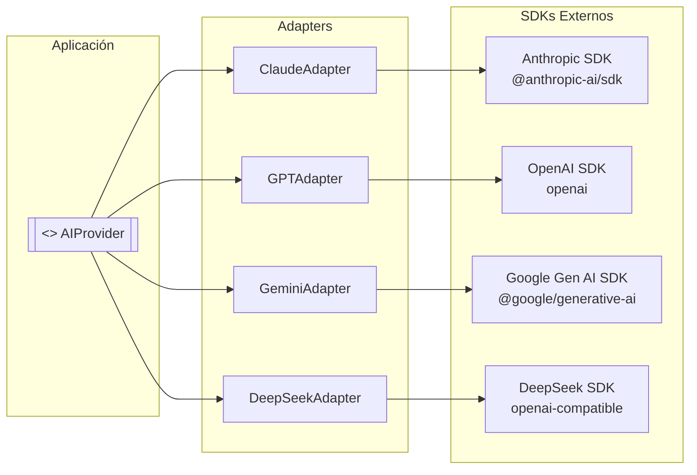

### 4.2 Responsabilidades de cada adapter

```typescript
// NO es código de implementación — es definición de responsabilidades

interface ClaudeAdapter extends AIProvider {
  // Responsabilidades:
  // 1. Traducir EntradaCanonica → Anthropic Message API
  //    - system prompt → system parameter
  //    - mensajes → messages array (user/assistant roles)
  //    - adjuntos → image blocks (base64)
  // 2. Invocar: anthropic.messages.create({ model, system, messages, max_tokens })
  // 3. Traducir respuesta → RespuestaCanonica
  //    - content[0].text → JSON.parse → mapear campos
  // 4. Extraer métricas: usage.input_tokens, usage.output_tokens
  // 5. Manejar errores específicos: overloaded_error, rate_limit_error
}

interface GPTAdapter extends AIProvider {
  // Responsabilidades:
  // 1. Traducir EntradaCanonica → OpenAI Chat Completion API
  //    - system prompt → messages[0] role=system
  //    - mensajes → messages[1..n] role=user/assistant
  //    - adjuntos → content parts (image_url)
  // 2. Invocar: openai.chat.completions.create({ model, messages })
  // 3. Traducir respuesta → RespuestaCanonica
  //    - choices[0].message.content → JSON.parse → mapear
  // 4. Extraer métricas: usage.prompt_tokens, usage.completion_tokens
  // 5. Manejar errores específicos: 429 rate_limit, 401 auth
}

interface GeminiAdapter extends AIProvider {
  // Responsabilidades:
  // 1. Traducir EntradaCanonica → Google Generative AI API
  //    - system prompt → system_instruction
  //    - mensajes → contents array (user/model roles)
  //    - adjuntos → inline_data (base64)
  // 2. Invocar: model.generateContent({ contents, systemInstruction })
  // 3. Traducir respuesta → RespuestaCanonica
  //    - response.text() → JSON.parse → mapear
  // 4. Extraer métricas: usageMetadata.promptTokenCount, ...
  // 5. Manejar errores específicos: 429 ResourceExhausted, invalid argument
}

interface DeepSeekAdapter extends AIProvider {
  // Responsabilidades:
  // 1. Usar OpenAI SDK con base_url apuntando a DeepSeek
  //    - new OpenAI({ baseURL: 'https://api.deepseek.com', apiKey })
  // 2. Traducir EntradaCanonica → DeepSeek Chat Completion
  //    - Misma estructura que OpenAI (API compatible)
  // 3. Invocar: openai.chat.completions.create({ model: 'deepseek-chat', messages })
  // 4. Traducir respuesta → RespuestaCanonica
  // 5. Extraer métricas: usage.prompt_tokens, usage.completion_tokens
  // 6. Manejar errores: mismos códigos que OpenAI
}
```

### 4.3 System Prompt compartido

Aunque el formato de `system` varía por proveedor, el contenido del **system prompt** es idéntico. Se define una vez y cada adapter lo formatea según la API de su proveedor.

```typescript
// NO es código de implementación — definición conceptual

const SYSTEM_PROMPT_V1 = `
Sos un asistente de gestión de turnos para el Instituto Lavalle 11 (Bahía Blanca, Argentina).
Tu trabajo es analizar conversaciones de WhatsApp y órdenes médicas para extraer datos estructurados.

## Catálogo de prácticas disponibles:
{lista_practicas}

## Prácticas que NO se realizan (responder automáticamente):
{lista_no_disponibles}

## Prácticas que se derivan a Sede Chiclana (Medicina Nuclear):
{lista_chiclana}

## Estudios que no requieren turno previo (orden de llegada):
{lista_sin_turno}

## Reglas de negocio:
- Si la práctica NO está en el catálogo → tipo_caso = "K"
- Si la práctica es de las que no requieren turno → tipo_caso = "B"
- Si la práctica es de Medicina Nuclear → tipo_caso = "E", flag = "chiclana"
- Si la práctica no se realiza → tipo_caso = "K", closing_reason automático

## Obras sociales vigentes:
{json_obras_sociales}

## Schema de respuesta JSON:
Debés responder ÚNICAMENTE con un objeto JSON válido según este schema:
{schema_json}
`;
```

El contenido de cada variable (`{lista_practicas}`, `{json_obras_sociales}`, etc.) se inyecta en **tiempo de ejecución**, no en el adapter. El `AnalisisService` construye el `system prompt` antes de invocar al provider.

---

## 5. Factory Pattern

### 5.1 AIProviderFactory

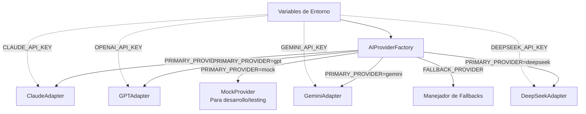

### 5.2 Comportamiento del Factory

| Escenario | Comportamiento |
|---|---|
| `PRIMARY_PROVIDER=claude` + `CLAUDE_API_KEY` set | Instancia `ClaudeAdapter` con el modelo `CLAUDE_MODEL` |
| `PRIMARY_PROVIDER=gpt` + `OPENAI_API_KEY` set | Instancia `GPTAdapter` con el modelo `GPT_MODEL` |
| `PRIMARY_PROVIDER=gemini` + `GEMINI_API_KEY` set | Instancia `GeminiAdapter` con el modelo `GEMINI_MODEL` |
| `PRIMARY_PROVIDER=deepseek` + `DEEPSEEK_API_KEY` set | Instancia `DeepSeekAdapter` con el modelo `DEEPSEEK_MODEL` |
| `PRIMARY_PROVIDER=mock` | Instancia `MockProvider` que devuelve fixtures predefinidos |
| PRIMARY falla y `FALLBACK_PROVIDER` está configurado | Devuelve el provider fallback |
| PRIMARY no configurado (env var faltante) | Lanza error en startup (fail fast) |
| PRIMARY y FALLBACK no tienen API key | Degrada a `MockProvider` con advertencia en logs |

### 5.3 API pública del Factory

```typescript
// NO es código de implementación — definición conceptual

interface AIProviderFactory {
  /** Obtiene el proveedor primario según configuración */
  getProvider(): AIProvider;

  /** Obtiene un proveedor específico por ID (para fallback manual) */
  getProviderById(id: ProveedorId): AIProvider;

  /** Lista todos los proveedores configurados */
  getProvidersDisponibles(): ProveedorId[];

  /** Proveedor de respaldo configurado (si existe) */
  getFallbackProvider(): AIProvider | null;
}
```

### 5.4 Registry pattern para auto-registro

Los providers no se instancian manualmente. El factory mantiene un **registry** donde cada provider se registra con su `ProveedorId`:

```mermaid
graph TB
    FACTORY[AIProviderFactory]
    REG[Registry<br/>Map<ProveedorId, ProviderFactory>]
    
    FACTORY --> REG
    
    subgraph "Registro automático"
        R1[ClaudeProvider<br/>register('claude')]
        R2[GPTProvider<br/>register('gpt')]
        R3[GeminiProvider<br/>register('gemini')]
        R4[DeepSeekProvider<br/>register('deepseek')]
        R5[MockProvider<br/>register('mock')]
    end
    
    REG --- R1
    REG --- R2
    REG --- R3
    REG --- R4
    REG --- R5
```

Cada provider se registra a sí mismo:

```typescript
// NO es código de implementación — registro conceptual
// En cada archivo de provider:
// AIProviderFactory.register('claude', (config) => new ClaudeAdapter(config));
// AIProviderFactory.register('gpt', (config) => new GPTAdapter(config));
// AIProviderFactory.register('mock', () => new MockProvider());
```

---

## 6. Flujo Completo de Análisis

### 6.1 Secuencia completa

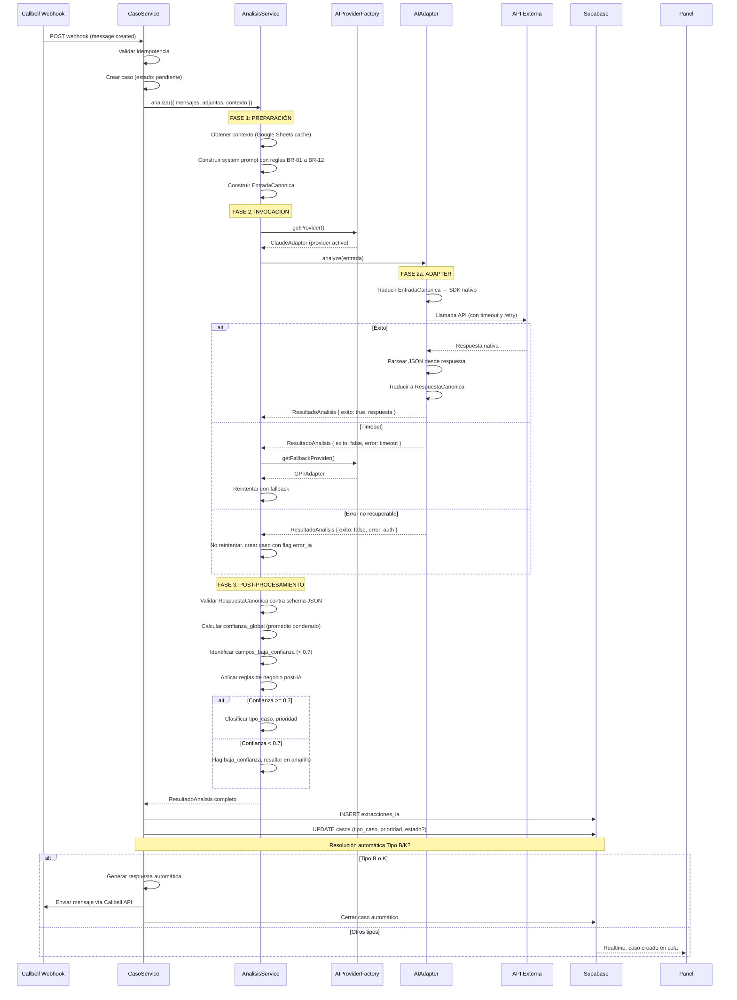

### 6.2 Fases del análisis

| Fase | Paso | Responsable | Descripción |
|---|---|---|---|
| **1. Preparación** | 1.1 | CasoService | Validar idempotencia del webhook |
| | 1.2 | CasoService | Crear registro en `casos` (estado: pendiente) |
| | 1.3 | CasoService | Obtener contextos: Google Sheets → obras sociales + precios |
| | 1.4 | AnalisisService | Construir `EntradaCanonica` con mensajes + adjuntos + contexto |
| | 1.5 | AnalisisService | Construir system prompt con reglas de negocio inyectadas |
| **2. Invocación** | 2.1 | AnalisisService | Obtener provider activo del Factory |
| | 2.2 | Adapter | Traducir `EntradaCanonica` al formato nativo del SDK |
| | 2.3 | Adapter | Ejecutar llamada API con timeout, reintentos, y tracing |
| | 2.4 | Adapter | Recibir respuesta nativa y traducir a `RespuestaCanonica` |
| | 2.5 | AnalisisService | Si falla: ejecutar fallback o degradar |
| **3. Post-procesamiento** | 3.1 | AnalisisService | Validar `RespuestaCanonica` contra schema JSON |
| | 3.2 | AnalisisService | Calcular `confianza_global` y `campos_baja_confianza` |
| | 3.3 | AnalisisService | Aplicar reglas de negocio: flags automáticos (BR-03, BR-06, etc.) |
| | 3.4 | AnalisisService | Clasificar tipo_caso y prioridad final |
| | 3.5 | CasoService | Persistir en `extracciones_ia` + actualizar `casos` |
| **4. Resolución** | 4.1 | CasoService | Si Tipo B o K: respuesta automática + cierre |
| | 4.2 | CasoService | Si otros tipos: Realtime → panel web |

### 6.3 Construcción del prompt

El `AnalisisService` construye el **contenido** del prompt. El `Adapter` construye el **formato** específico del SDK.

```mermaid
graph LR
    subgraph "AnalisisService (contenido)"
        SP[System Prompt<br/>Texto plano]
        MSG[Historial mensajes<br/>Texto plano]
        CTX[Contexto<br/>JSON]
    end
    
    subgraph "Adapter (formato)"
        CP[Claude: system param<br/>+ messages array<br/>+ image blocks]
        OP[GPT: messages[0] role=system<br/>+ content parts<br/>+ image_url]
        GP[Gemini: system_instruction<br/>+ contents array<br/>+ inline_data]
        DP[DeepSeek: igual a GPT]
    end
    
    SP --> CP
    MSG --> CP
    CTX --> CP
    
    SP --> OP
    MSG --> OP
    CTX --> OP
    
    SP --> GP
    MSG --> GP
    CTX --> GP
    
    SP --> DP
    MSG --> DP
    CTX --> DP
```

---

## 7. Manejo de Errores

### 7.1 Catálogo de errores

| Código | Causa típica | ¿Recuperable? | Acción del sistema |
|---|---|---|---|
| `timeout` | La API tardó > `PROVIDER_TIMEOUT_MS` (default 30s) | ✅ Sí | Reintentar 1 vez con backoff. Si falla de nuevo, ejecutar fallback |
| `rate_limited` | Límite de requests excedido (429) | ✅ Sí | Esperar `Retry-After` header (mín 5s) y reintentar. Si falla de nuevo, ejecutar fallback |
| `authentication_error` | API key inválida o expirada (401) | ❌ No | Crear caso con flag `error_ia`. Alertar al admin. No reintentar |
| `invalid_response` | La API respondió pero el contenido no es JSON válido | ✅ Sí | Reintentar 1 vez con prompt reforzado \"DEBÉS responder SOLO JSON\". Si falla, degradar |
| `json_parse_error` | Respuesta JSON mal formada | ✅ Sí | Intentar extraer JSON del texto con regex. Si falla, reintentar |
| `schema_validation_error` | JSON válido pero no cumple el schema esperado | ❌ No | Crear caso con flag `error_ia`. Los campos válidos se conservan |
| `content_filtered` | El contenido fue filtrado por políticas del proveedor | ❌ No | Crear caso sin extracción IA. Flag `error_ia`. El asesor analiza manualmente |
| `context_length_exceeded` | El prompt es demasiado largo para el modelo | ✅ Sí | Reintentar truncando el historial de mensajes (últimos N). Si falla, degradar |
| `service_unavailable` | El proveedor devolvió 503 | ✅ Sí | Reintentar 2 veces con backoff exponencial. Ejecutar fallback |
| `unknown` | Error inesperado | ❌ No | Crear caso con flag `error_ia`. Log para debugging |

### 7.2 Estrategia de reintentos

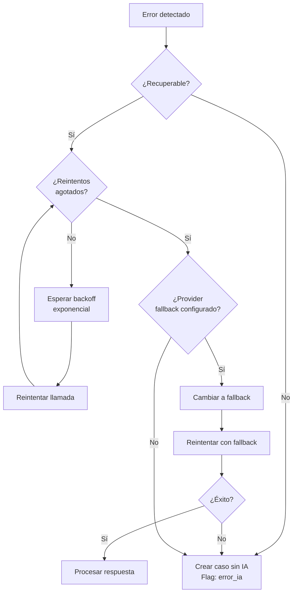

### 7.3 Parámetros de reintento

| Parámetro | Default | Descripción |
|---|---|---|
| `PROVIDER_MAX_RETRIES` | 2 | Número máximo de reintentos en el mismo proveedor |
| `PROVIDER_TIMEOUT_MS` | 30000 | Timeout por llamada (30 segundos) |
| `PROVIDER_RETRY_BASE_DELAY_MS` | 1000 | Delay base para backoff exponencial (1s) |
| `PROVIDER_RETRY_MAX_DELAY_MS` | 10000 | Delay máximo (10s) |
| `FALLBACK_ENABLED` | `true` | ¿Intentar fallback si el primario falla? |

### 7.4 Degradación controlada

Cuando todos los reintentos y fallbacks se agotan:

1. El caso se crea igual en `casos` (estado: `pendiente`)
2. En `extracciones_ia` solo se guardan los datos que se pudieron extraer (puede ser vacío)
3. Se agrega flag `error_ia`
4. `confianza_global = 0`
5. `resumen = "Error al procesar con IA. El asesor debe completar manualmente."`
6. El caso aparece en la cola con un badge rojo "Error IA"
7. Se registra el evento `caso.error_ia` en `auditoria_eventos`

---

## 8. Estrategia Fallback

### 8.1 Modalidades de fallback

| Modalidad | Configuración | Comportamiento |
|---|---|---|
| **Sin fallback** | `FALLBACK_PROVIDER=""` | Si el proveedor primario falla, se degrada (flag `error_ia`) |
| **Fallback a otro proveedor** | `FALLBACK_PROVIDER=gpt` | Si Claude falla, se reintenta con GPT automáticamente |
| **Fallback al mismo proveedor (modelo diferente)** | `FALLBACK_PROVIDER=claude` + `FALLBACK_MODEL=claude-haiku-4` | Si Sonnet falla, se reintenta con Haiku (más barato, más rápido) |
| **Fallback a mock** | `FALLBACK_PROVIDER=mock` | Para desarrollo: si el proveedor real falla, se usa un fixture predefinido |

### 8.2 Árbol de decisión de fallback

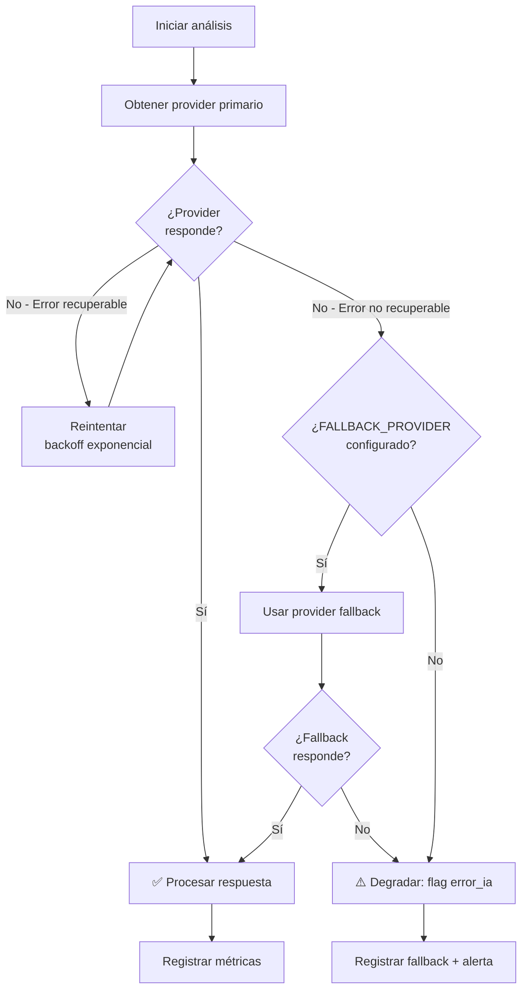

### 8.3 Tiempos de fallback

| Evento | Tiempo estimado |
|---|---|
| Llamada primaria exitosa | 5–15s |
| Timeout + reintento (1er intento) | +30s |
| Reintento con backoff | +1s → +2s → +4s |
| Fallback a otro proveedor | 5–15s adicionales |
| **Total peor caso (timeout + reintentos + fallback exitoso)** | **~55–70s** |
| **Total peor caso (todo falla)** | **~60–75s** → degradación |

> **Nota:** El webhook de Callbell tiene un timeout propio (~30s). Si el análisis supera ese tiempo, se debe responder `200` inmediatamente y procesar de forma asíncrona. El caso se crea como `pendiente` y se actualiza vía Realtime cuando el análisis termine.

---

## 9. Configuración por Variables de Entorno

### 9.1 Variables requeridas

```env
# ─── Proveedor activo ──────────────────────────────────
# Valores posibles: claude | gpt | gemini | deepseek | mock
# Si no se configura, falla en startup
PRIMARY_PROVIDER=claude

# ─── Claude (Anthropic) ───────────────────────────────
CLAUDE_API_KEY=sk-ant-...
CLAUDE_MODEL=claude-sonnet-4-20250514
# Alternativas: claude-haiku-4-20250514 (más barato/rápido)

# ─── GPT (OpenAI) ────────────────────────────────────
OPENAI_API_KEY=sk-proj-...
GPT_MODEL=gpt-4o
# Alternativas: gpt-4o-mini, gpt-4.1

# ─── Gemini (Google) ─────────────────────────────────
GEMINI_API_KEY=AIza...
GEMINI_MODEL=gemini-2.5-pro

# ─── DeepSeek ────────────────────────────────────────
DEEPSEEK_API_KEY=sk-...
DEEPSEEK_MODEL=deepseek-chat
DEEPSEEK_BASE_URL=https://api.deepseek.com

# ─── Fallback ─────────────────────────────────────────
# Proveedor de respaldo si el primario falla
# Mismas opciones que PRIMARY_PROVIDER. Vacío = sin fallback
FALLBACK_PROVIDER=gpt

# Modelo del fallback (opcional, default = modelo del proveedor)
FALLBACK_MODEL=gpt-4o-mini

# ─── Tiempos y reintentos ─────────────────────────────
PROVIDER_TIMEOUT_MS=30000
PROVIDER_MAX_RETRIES=2
PROVIDER_RETRY_BASE_DELAY_MS=1000
PROVIDER_RETRY_MAX_DELAY_MS=10000

# ─── Costo y límites ─────────────────────────────────
# Costo máximo permitido por llamada (USD)
# Si se supera, se degrada automáticamente al proveedor más barato
MAX_COST_PER_CALL_USD=0.10
```

### 9.2 Configuración por entorno

| Entorno | PRIMARY_PROVIDER | FALLBACK_PROVIDER | Modelo | Costo estimado por llamada |
|---|---|---|---|---|
| **Desarrollo** | `mock` | — | Fixtures locales | $0 |
| **Testing** | `claude` (con cuota limitada) | `mock` | claude-haiku-4 | ~$0.003 |
| **Staging** | `claude` | `gpt` | claude-sonnet-4 | ~$0.03 |
| **Producción (default)** | `claude` | `gpt` | claude-sonnet-4 | ~$0.03 |
| **Producción (ahorro)** | `gpt` | `claude` | gpt-4o-mini | ~$0.002 |
| **Emergencia (caída Claude)** | `gpt` | `deepseek` | gpt-4o | ~$0.01 |

### 9.3 Validación en startup

Al iniciar el backend, el `AIProviderFactory` valida que:

1. `PRIMARY_PROVIDER` esté definido y sea un valor válido
2. La API key del proveedor primario exista en las variables de entorno
3. Si `FALLBACK_PROVIDER` está definido, su API key también exista
4. Los modelos referenciados sean válidos (por nombre, no se valida contra la API)

Si alguna validación falla, el sistema:

- **En desarrollo:** Loguea una advertencia y usa `mock` como fallback automático
- **En producción:** Falla en startup (evita tener un sistema que parece funcionar pero no puede analizar casos)

---

## 10. Estrategia para Cambiar de Proveedor en Producción

### 10.1 Cambio planificado (por configuración)

El método más seguro y recomendado para cambios programados:

```
Paso 1: Configurar ambos proveedores en las variables de entorno
Paso 2: PRIMARY_PROVIDER=claude, FALLBACK_PROVIDER=gpt  ← ambos funcionando
Paso 3: Dejar correr 24–48hs con fallback configurado pero no activo
Paso 4: Revisar métricas de ambos proveedores en logs
Paso 5: Cambiar PRIMARY_PROVIDER=gpt
Paso 6: Monitorear 24–48hs
Paso 7: Si todo ok, remover FALLBACK_PROVIDER o ajustar
```

### 10.2 Cambio por emergencia (caída del proveedor)

Si el proveedor primario deja de responder:

```
Escenario: Claude API caída global (503)
Detección: Health check falla 3 veces consecutivas en 30 segundos
Acción automática: El sistema cambia a FALLBACK_PROVIDER
Notificación: Alerta en Slack/email al admin
Acción manual: Admin actualiza PRIMARY_PROVIDER en dashboard de Vercel
```

### 10.3 Cambio por costo (auto-tuning)

Si `MAX_COST_PER_CALL_USD` se supera consistentemente:

```
Opción A: Cambiar a un modelo más barato del mismo proveedor
  claude-sonnet-4 → claude-haiku-4  (ahorro ~10x)

Opción B: Cambiar de proveedor
  claude → gpt-4o-mini  (ahorro ~15x)

Opción C: Degradar solo ciertos tipos de caso
  Tipo B/K (automáticos) → modelo barato
  Tipo A/H (complejos) → modelo premium
```

### 10.4 Matriz de decisión: qué proveedor usar para qué caso

| Tipo de caso | Proveedor recomendado | Razón |
|---|---|---|
| **A** (Turno con orden) | Claude Sonnet | Mejor comprensión de órdenes manuscritas |
| **B** (Automático) | Cualquier modelo barato | Solo requiere detección de práctica |
| **C** (Precios) | Cualquiera | Consulta simple a tabla |
| **D** (Copago) | Cualquiera | Regla determinística post-IA |
| **E** (Chiclana) | Cualquiera | Detección por práctica |
| **F** (Resultados) | Cualquiera | Consulta simple |
| **G** (Médico) | Cualquiera | Solo extraer nombre y matrícula |
| **H** (Punción) | Claude Sonnet | Alto nivel de detalle requerido |
| **I** (Reprogramación) | Cualquiera | Consulta simple |
| **J** (Cancelación) | Cualquiera | Consulta simple |
| **K** (Equivocado/No disponible) | Modelo barato | Detección por catálogo |

> **Nota:** El enrutamiento por tipo de caso es una mejora post-MVP. En v1, todos los casos usan el mismo proveedor configurado en `PRIMARY_PROVIDER`.

### 10.5 Rollback

Si el nuevo proveedor tiene problemas:

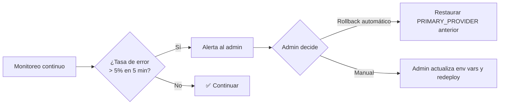

---

## 11. Estrategia de Testing

### 11.1 Pirámide de testing

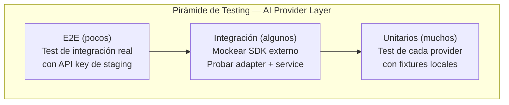

### 11.2 Tipos de test

| Tipo | Qué prueba | Cómo | Velocidad | Frecuencia |
|---|---|---|---|---|
| **Unit test** | Cada provider aísla: traducción entrada/salida, manejo de errores | Mock del SDK externo + fixtures locales | ⚡ ms | Cada commit |
| **Integration test** | AnalisisService + Adapter + Factory | Mock del SDK externo, probar flujo completo de análisis | ⚡ ms–s | Cada PR |
| **Contract test** | Que la respuesta de cada provider cumple el schema esperado | Fixtures de respuesta de cada proveedor | ⚡ ms | Cada PR |
| **E2E test (staging)** | Flujo real con API key de staging (cuota limitada) | Llamada real a la API con un caso de prueba conocido | 🐢 10–30s | Diario / pre-release |
| **Chaos test** | Proveedor caído, timeout, rate limit | Simular fallos en cada punto | 🐢 5–10s | Semanal |
| **Cost monitoring** | Costo real por llamada en producción | Observabilidad + métricas | 📊 Continuo | Tiempo real |

### 11.3 MockProvider — Para desarrollo y testing

El `MockProvider` es un provider especial que:

1. Implementa la misma interfaz `AIProvider`
2. No hace llamadas externas (sin API key requerida)
3. Devuelve respuestas predefinidas desde fixtures JSON
4. Permite simular errores (timeout, invalid_response) para testear fallbacks

```typescript
// NO es código de implementación — definición conceptual
interface MockConfig {
  scenario: "success" | "timeout" | "invalid_json" | "low_confidence" | "error";
  responseFixture?: string;            // Nombre del fixture a usar
  delayMs?: number;                    // Delay simulado (default 100ms)
}
```

### 11.4 Fixtures de prueba

Cada fixture es un archivo JSON que representa una `RespuestaCanonica` completa:

```
src/ai-providers/fixtures/
├── caso-tipo-a-exitoso.json          # Turno estándar con orden
├── caso-tipo-b-automatico.json       # Radiografía sin turno
├── caso-tipo-e-chiclana.json         # Derivación a Chiclana
├── caso-tipo-h-puncion.json          # Punción con seguimiento
├── caso-tipo-k-no-disponible.json    # Práctica no disponible
├── orden-ilegible.json               # Imagen de orden ilegible
├── baja-confianza.json               # Múltiples campos con confianza < 0.7
└── sin-datos-suficientes.json        # Mensaje sin información clara
```

### 11.5 Test de contrato entre proveedores

Para garantizar que todos los proveedores producen respuestas semánticamente equivalentes:

```typescript
// NO es código de implementación — prueba conceptual
describe('Equivalencia entre proveedores', () => {
  const entrada = getFixture('caso-tipo-a');

  it('Claude y GPT deben producir la misma clasificación', async () => {
    const claude = await claudeAdapter.analyze(entrada);
    const gpt = await gptAdapter.analyze(entrada);

    expect(claude.respuesta?.clasificacion.tipo_caso)
      .toBe(gpt.respuesta?.clasificacion.tipo_caso);
  });

  it('Todos los proveedores deben respetar el schema de salida', async () => {
    for (const provider of [claudeAdapter, gptAdapter, geminiAdapter]) {
      const result = await provider.analyze(entrada);
      expect(isValidResponseSchema(result.respuesta)).toBe(true);
    }
  });
});
```

---

## 12. Diagramas Mermaid

### 12.1 Diagrama de contexto del sistema (con AI Provider Layer)

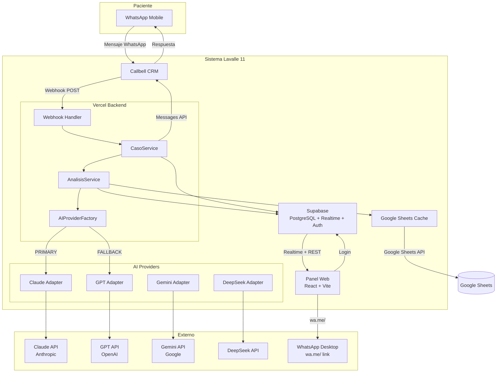

### 12.2 Diagrama de clases (AI Provider Layer)

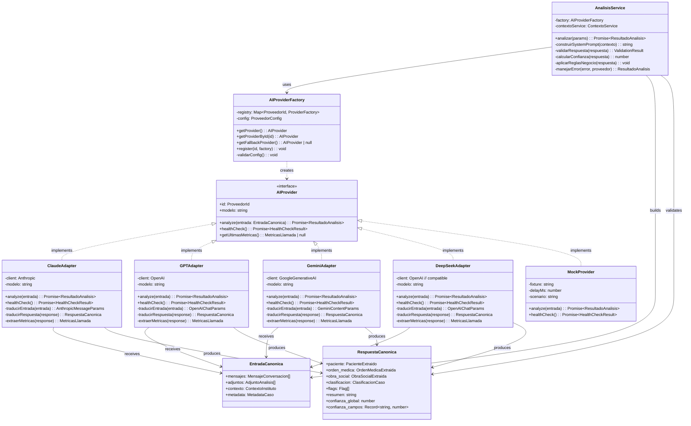

### 12.3 Diagrama de secuencia: fallback completo

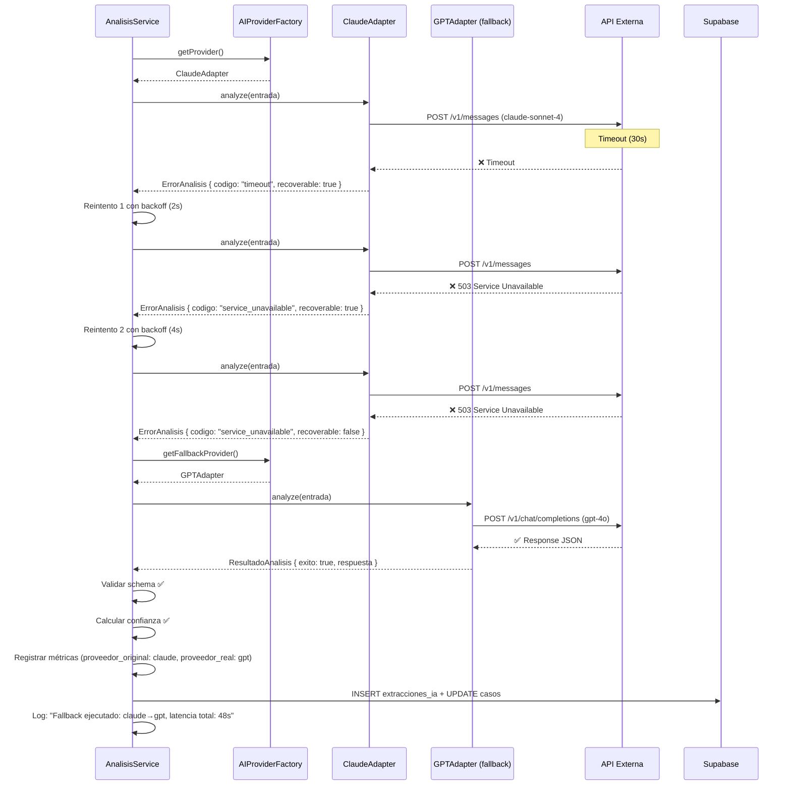

---

## Apéndice A: Resumen de Archivos del Provider Layer

| Archivo | Propósito | Dependencias |
|---|---|---|
| `src/ai-providers/interfaces.ts` | Interfaces `AIProvider`, `EntradaCanonica`, `RespuestaCanonica`, tipos compartidos | Ninguna |
| `src/ai-providers/registry.ts` | Registry de proveedores + método `register()` | `interfaces.ts` |
| `src/ai-providers/factory.ts` | `AIProviderFactory`: selecciona provider según env vars | `registry.ts`, `config.ts` |
| `src/ai-providers/config.ts` | Lectura y validación de variables de entorno | Ninguna |
| `src/ai-providers/claude-adapter.ts` | Implementación para Claude (Anthropic SDK) | `interfaces.ts`, `@anthropic-ai/sdk` |
| `src/ai-providers/gpt-adapter.ts` | Implementación para GPT (OpenAI SDK) | `interfaces.ts`, `openai` |
| `src/ai-providers/gemini-adapter.ts` | Implementación para Gemini (Google Gen AI SDK) | `interfaces.ts`, `@google/generative-ai` |
| `src/ai-providers/deepseek-adapter.ts` | Implementación para DeepSeek (OpenAI-compatible) | `interfaces.ts`, `openai` |
| `src/ai-providers/mock-provider.ts` | Mock para desarrollo y testing | `interfaces.ts` |
| `src/ai-providers/errors.ts` | Tipos de error, mapeo de códigos, helper functions | Ninguna |
| `src/ai-providers/metrics.ts` | Métricas de llamada, cálculo de costos | Ninguna |
| `src/services/analisis-service.ts` | Orquestador: prepara prompt, invoca provider, valida respuesta, post-procesa | `factory.ts`, `contexto-service.ts` |
| `src/ai-providers/fixtures/*.json` | Fixtures de prueba para MockProvider | Ninguna |
| `src/ai-providers/__tests__/*.test.ts` | Tests unitarios, de integración y de contrato | `*.ts` |

## Apéndice B: Costo estimado por proveedor

| Proveedor | Modelo | Costo entrada (por 1M tokens) | Costo salida (por 1M tokens) | Costo estimado por llamada típica* |
|---|---|---|---|---|
| Claude | sonnet-4-20250514 | $15.00 | $75.00 | ~$0.03 |
| Claude | haiku-4-20250514 | $0.80 | $4.00 | ~$0.003 |
| GPT | gpt-4o | $2.50 | $10.00 | ~$0.01 |
| GPT | gpt-4o-mini | $0.15 | $0.60 | ~$0.002 |
| Gemini | gemini-2.5-pro | $1.25–$2.50 | $5.00–$10.00 | ~$0.01 |
| DeepSeek | deepseek-chat | $0.14 | $0.28 | ~$0.001 |

*\*Estimado para ~2000 tokens de entrada + ~500 tokens de salida por llamada típica.*

## Apéndice C: Integración con el sistema existente

El `AnalisisService` se integra con los componentes existentes del sistema:

| Componente existente | Integración con AI Provider Layer |
|---|---|
| `CasoService` (mockService.ts) | Invoca `AnalisisService.analizar()` después de crear el caso |
| `extracciones_ia` (DB) | El resultado de `RespuestaCanonica` se mapea directamente a los campos de la tabla |
| `casos.tipo_caso` | Se actualiza con `RespuestaCanonica.clasificacion.tipo_caso` |
| `casos.prioridad` | Se actualiza con `RespuestaCanonica.clasificacion.prioridad_sugerida` |
| Google Sheets cache | El `AnalisisService` obtiene el contexto de obras sociales antes de invocar al provider |
| Callbell webhook | El webhook handler es el trigger inicial, pero no conoce al provider |
| Realtime | La actualización de `casos` y `extracciones_ia` dispara Realtime automáticamente |

---

> **Documento aprobado para implementación.** Próximo paso: implementar interfaces y ClaudeAdapter como provider inicial.
