# ARCHITECTURE — Arquitectura del Sistema

> **Proyecto:** Panel de Gestión de Turnos con IA — Instituto Lavalle 11
> **Última actualización:** 2026-06-09
> **Basado en:** PRD v1.0 Draft
>
> Este documento describe la arquitectura completa del sistema usando diagramas Mermaid.
> No contiene código ni SQL — solo decisiones arquitectónicas y flujos.

---

## 1. Arquitectura General

### 1.1 Diagrama de contexto (C4 — Nivel 1)

```mermaid
graph TB
    subgraph "Paciente"
        WP[WhatsApp Mobile]
    end

    subgraph "Sistema Lavalle 11"
        CB[Callbell CRM]
        VC[Vercel Serverless<br/>Backend Node.js]
        SB[Supabase<br/>PostgreSQL + Realtime]
        FW[Panel Web<br/>React + Vite]
        CL[Claude API<br/>Anthropic]
        GS[Google Sheets API]
    end

    subgraph "Externo"
        WD[WhatsApp Desktop<br/>wa.me/ link]
    end

    WP -->|Mensaje WhatsApp| CB
    CB -->|Webhook HTTP POST| VC
    VC -->|Análisis IA| CL
    VC -->|Obras sociales y precios| GS
    VC -->|CRUD + Realtime| SB
    SB -->|Realtime WebSocket| FW
    FW -->|Login| SB
    FW -->|Acción wa.me/| WD
    VC -->|Messages API| CB
    CB -->|Respuesta WhatsApp| WP
```

### 1.2 Visión general del sistema

El sistema sigue una **arquitectura orientada a eventos** con 5 componentes principales:

| Componente | Rol | Tecnología |
|---|---|---|
| **Callbell CRM** | Fuente de eventos entrantes y canal de salida | Callbell API (externa) |
| **Backend (Vercel)** | Orquestador central: webhooks, IA, persistencia | Node.js Serverless |
| **Supabase** | Almacenamiento, Realtime, Autenticación | PostgreSQL + WebSocket |
| **Panel Web** | Interfaz del asesor: cards, modal, métricas | React + Vite + Tailwind |
| **Claude API** | Motor de IA: análisis de texto e imágenes | claude-sonnet-4-20250514 |

### 1.3 Patrones arquitectónicos

| Patrón | Aplicación |
|---|---|
| **Event-Driven** | Cada mensaje entrante genera eventos que fluyen: webhook → análisis → DB → Realtime → UI |
| **CQRS** | Separación de escrituras (webhook POST → DB) y lecturas (Realtime WebSocket → panel) |
| **Saga / Orquestación** | Un orquestador central dirige el flujo según el tipo de caso (A–K) |
| **Cache-Aside** | Google Sheets se cachea en Supabase con TTL de 5 minutos |
| **Idempotent Receiver** | Webhooks duplicados se detectan por `callbell_uuid + message_id` |
| **Strangler Fig** | El panel crece junto a Callbell, haciéndolo progresivamente invisible |

---

## 2. Frontend

### 2.1 Arquitectura del panel web

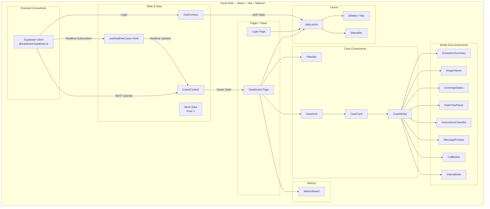

### 2.2 Vista de cola de casos (layout)

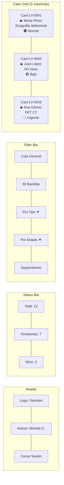

### 2.3 Gestión de vistas (5 filtros)

| Vista | Filtro | Descripción |
|---|---|---|
| **Cola general** | Ninguno | Todos los casos activos ordenados por prioridad + tiempo de espera |
| **Mi bandeja** | `asesor_id = auth.uid()` | Solo casos asignados al asesor logueado |
| **Por tipo** | `tipo_caso = X` | Filtro por los 11 tipos (A–K) |
| **Por estado** | `estado = X` | pendiente / en_proceso / esperando_respuesta |
| **Seguimientos** | `seguimiento_fecha = hoy` | Casos con seguimiento programado para hoy |

### 2.4 Gestión de estados del frontend

| Estado | Mecanismo | Propósito |
|---|---|---|
| **Autenticación** | React Context (`AuthContext`) | Sesión del usuario, rol, token |
| **Casos en cola** | React Context (`CasesContext`) | Lista de casos visibles según filtro activo |
| **Realtime** | Hook `useRealtimeCases` | Suscripción WebSocket a cambios en Supabase |
| **Modal** | Estado local (`useState`) | Card seleccionada, visibilidad del modal |
| **Formulario** | Estado local (`useState`) | Valores del formulario, vista previa del mensaje |
| **Filtro activo** | Estado local (`useState`) | Tipo de filtro seleccionado |

---

## 3. Backend

### 3.1 Arquitectura del backend (Vercel Serverless)

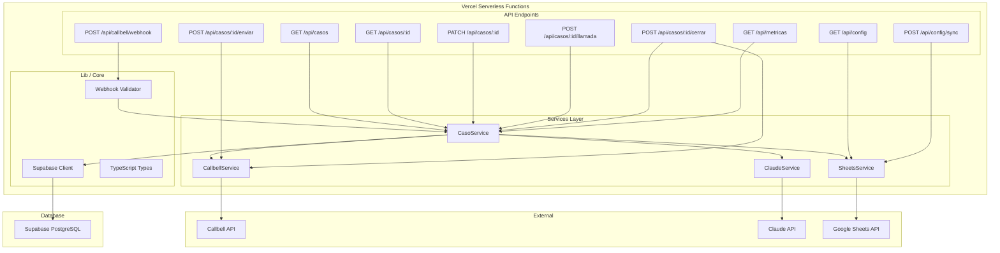

### 3.2 Endpoints de la API REST

| Método | Ruta | Función | Request | Response |
|---|---|---|---|---|
| POST | `/api/callbell/webhook` | Recibir evento de Callbell | Payload de Callbell | `200 OK` |
| GET | `/api/casos` | Listar casos | Query: tipo, estado, asesor, created_at | `Casos[]` |
| GET | `/api/casos/:id` | Detalle de caso | — | `Caso + ExtraccionIA + Turnos + Llamadas` |
| PATCH | `/api/casos/:id` | Actualizar caso | `{ estado, asesor_id, ... }` | `Caso` |
| POST | `/api/casos/:id/enviar` | Enviar mensaje | `{ mensaje, tipo }` | `{ success, callbell_msg_id }` |
| POST | `/api/casos/:id/llamada` | Registrar llamada | `{ duracion_min }` | `Llamada` |
| POST | `/api/casos/:id/cerrar` | Cerrar caso | `{ closing_reason, nota }` | `Caso` |
| GET | `/api/metricas` | Obtener KPIs (admin) | — | `{ activos, tiempos, volumen, ... }` |
| GET | `/api/config` | Obtener configuración | — | `{ obras_sociales[], precios[] }` |
| POST | `/api/config/sync` | Forzar sync Google Sheets (admin) | — | `{ sync_status }` |

### 3.3 Orquestación de casos por tipo

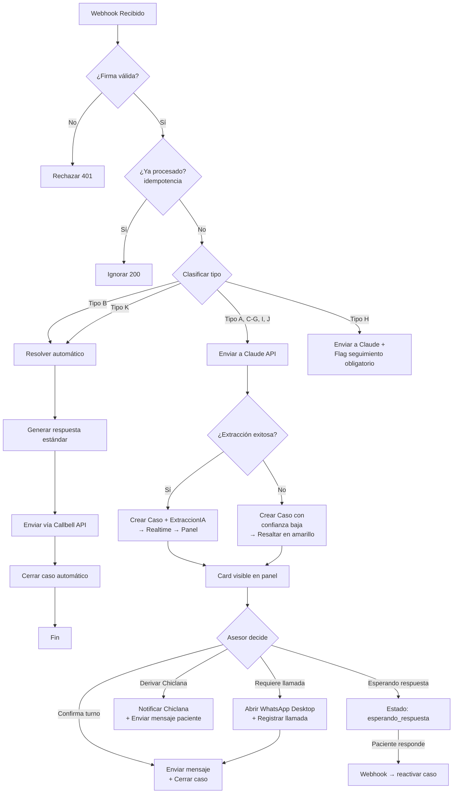

---

## 4. Base de Datos

### 4.1 Modelo entidad-relación

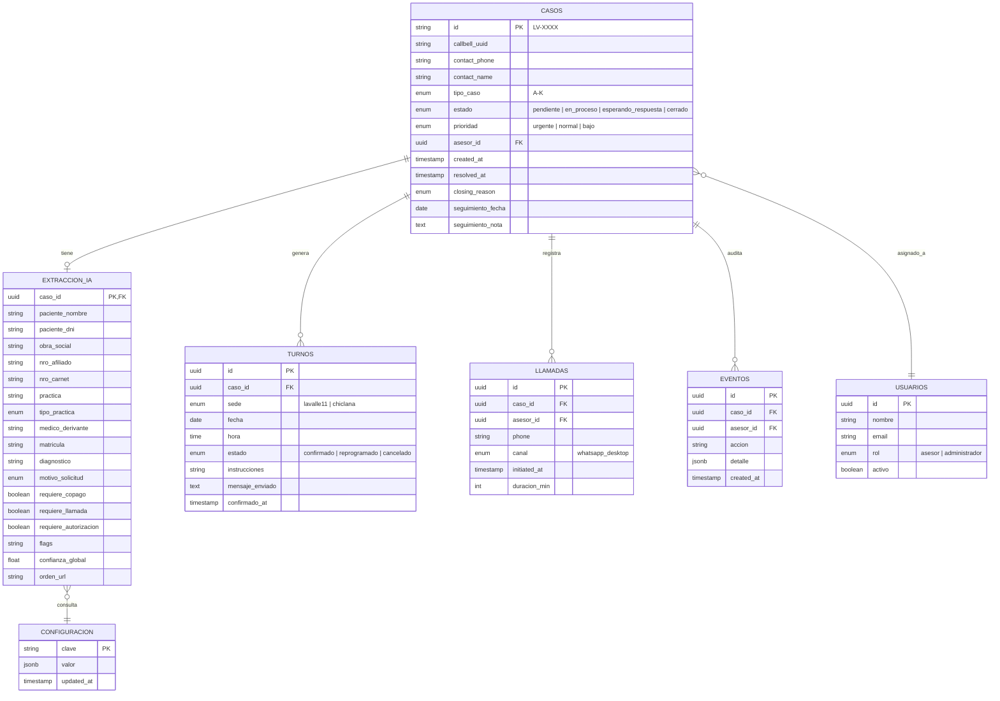

### 4.2 Relaciones entre entidades

| Entidad A | Relación | Entidad B | Regla |
|---|---|---|---|
| `casos` | 1 → 1 | `extraccion_ia` | Cada caso tiene exactamente una extracción IA |
| `casos` | 1 → N | `turnos` | Un caso puede tener múltiples turnos (historial de reprogramaciones) |
| `casos` | 1 → N | `llamadas` | Un caso puede tener múltiples llamadas registradas |
| `casos` | 1 → N | `eventos` | Cada acción sobre un caso se registra como evento de auditoría |
| `casos` | N → 1 | `usuarios` | Un asesor puede tener muchos casos asignados |
| `extraccion_ia` | N → 1 | `configuracion` | La extracción consulta la configuración de obras sociales |

### 4.3 Reglas de integridad

- **Soft delete:** Ninguna entidad se elimina físicamente. Los casos se "cierran" cambiando su estado
- **Clave primaria de casos:** Formato `LV-XXXX` (autoincremental, 4 dígitos)
- **callbell_uuid:** Único — usado para idempotencia de webhooks
- **Cascada:** Al cerrar un caso, no se eliminan los turnos ni llamadas asociados (persisten para historial)
- **Auditoría:** Toda acción de escritura genera un registro en `eventos`

---

## 5. Flujo de Callbell

### 5.1 Integración con Callbell CRM

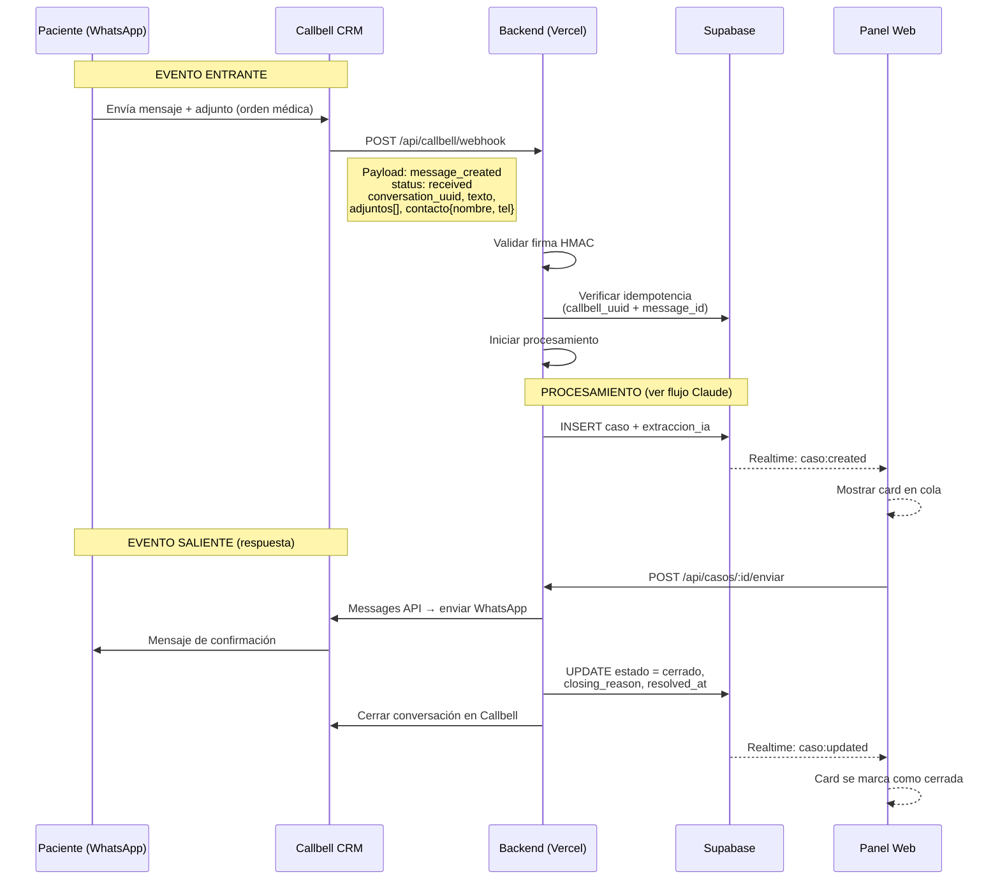

### 5.2 Eventos que Callbell envía

| Evento | Condición | Acción del backend |
|---|---|---|
| `message_created` + `status = received` | Paciente envió un mensaje | Iniciar procesamiento del caso |
| `message_created` + `status = sent` | Mensaje enviado por el asesor | Ignorar (es ida, no vuelta) |
| `conversation_opened` | Conversación abierta en Callbell | Registrar metadata |
| `conversation_closed` | Conversación cerrada en Callbell | Verificar si el caso quedó abierto |

### 5.3 Webhook — Especificación técnica

```
POST /api/callbell/webhook
Content-Type: application/json
Headers:
  x-callbell-signature: HMAC_SHA256(payload, CALLBELL_WEBHOOK_SECRET)

Payload:
{
  "event": "message_created",
  "conversation_uuid": "abc-123",
  "message": {
    "id": "msg_001",
    "text": "Hola, quiero turno para una ecografía",
    "status": "received",
    "attachments": [
      {
        "type": "image/jpeg",
        "url": "https://callbell.com/media/orden_medica.jpg"
      }
    ],
    "created_at": "2026-06-09T10:30:00Z"
  },
  "contact": {
    "name": "María Pérez",
    "phone": "5492915551234"
  },
  "channel": "whatsapp"
}
```

### 5.4 Mensajes salientes vía Callbell Messages API

```
POST https://api.callbell.com/v1/messages/send
Authorization: Bearer CALLBELL_API_KEY

{
  "to": "5492915551234",
  "from": "whatsapp",
  "type": "text",
  "text": {
    "body": "Hola María, te confirmamos tu turno:\n\n📅 Fecha: 15/06/2026\n⏰ Hora: 10:30\n📍 Sede: Lavalle 11\n\n📋 Instrucciones:\n- Asistir en ayunas (6 horas)\n- Traer orden médica\n- Traer estudios previos\n\n⚠️ Recordatorio: IOMA - No olvides tu TOKEN de la app\n\nSaludos, Instituto Lavalle 11"
  }
}
```

---

## 6. Flujo de Claude

### 6.1 Interacción con Claude API

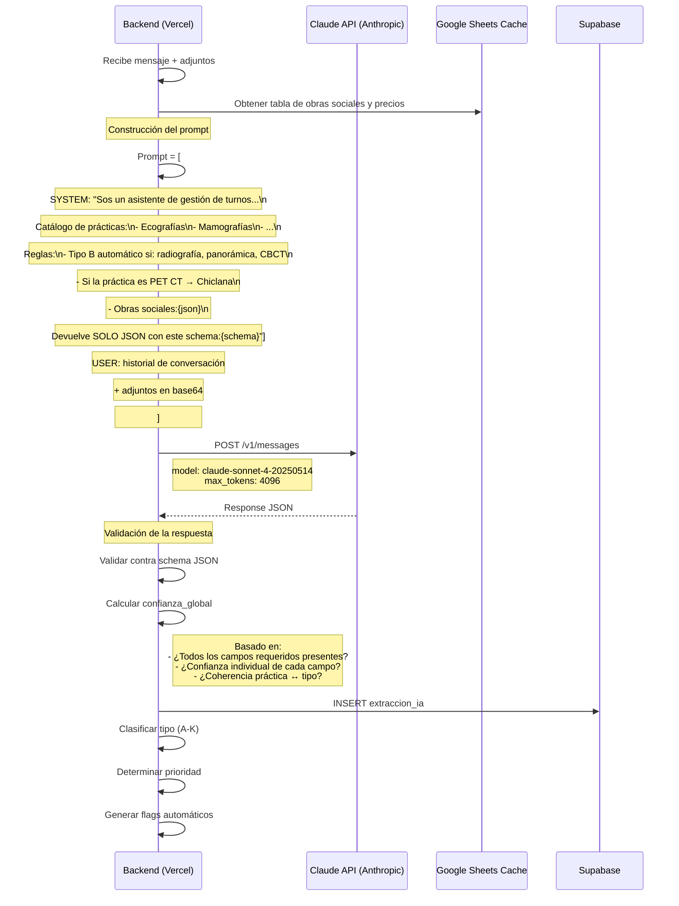

### 6.2 Schema JSON de salida de Claude

```json
{
  "paciente": {
    "nombre": "María Pérez",
    "dni": "30.123.456",
    "confianza": 0.95
  },
  "orden_medica": {
    "practica": "Ecografía abdominal",
    "tipo_practica": "ecografia",
    "medico_derivante": "Dr. Rodríguez",
    "matricula": "MP 12345",
    "diagnostico": "Dolor abdominal inespecífico",
    "motivo_solicitud": "screening",
    "confianza": 0.88
  },
  "obra_social": {
    "nombre": "IOMA",
    "nro_afiliado": "AF-987654",
    "nro_carnet": "CA-654321",
    "confianza": 0.92
  },
  "flags": {
    "requiere_ayuno": true,
    "requiere_aines": false,
    "orden_incompleta": false,
    "posible_contacto_equivocado": false,
    "practica_no_disponible": false
  },
  "clasificacion": {
    "tipo_caso": "A",
    "razon": "Turno estándar con orden médica completa",
    "prioridad_sugerida": "normal"
  },
  "resumen": "Paciente solicita turno para ecografía abdominal. Obra social IOMA. Orden médica completa del Dr. Rodríguez.",
  "confianza_global": 0.91
}
```

### 6.3 Prompts del sistema

El prompt que se envía a Claude contiene:

| Componente | Descripción | Tamaño estimado |
|---|---|---|
| **System prompt** | Contexto del instituto, catálogo de prácticas, reglas de negocio, schema JSON de salida | ~2000 tokens |
| **Historial de conversación** | Últimos N mensajes de la conversación en Callbell | Variable |
| **Adjuntos** | Imágenes/PDF convertidos a base64 | Variable (dominante) |
| **Tabla de obras sociales** | JSON con datos de cobertura desde Google Sheets cache | ~500 tokens |

### 6.4 Estrategia de manejo de errores de Claude

| Escenario | Acción |
|---|---|
| **Timeout (> 15s)** | Reintentar 1 vez con backoff. Si falla de nuevo, crear caso con estado `pendiente` y flag `error_ia` |
| **JSON inválido** | Solicitar a Claude que re-formatee la respuesta. Si falla, clasificar como `no_clasificado` |
| **Confianza < 0.5** | Crear caso con todos los campos resaltados en amarillo. El asesor debe completar manualmente |
| **Adjunto ilegible** | Flag `orden_ilegible`. El asesor ve la imagen original y transcribe manualmente |

---

## 7. Flujo de Google Sheets

### 7.1 Arquitectura de sincronización

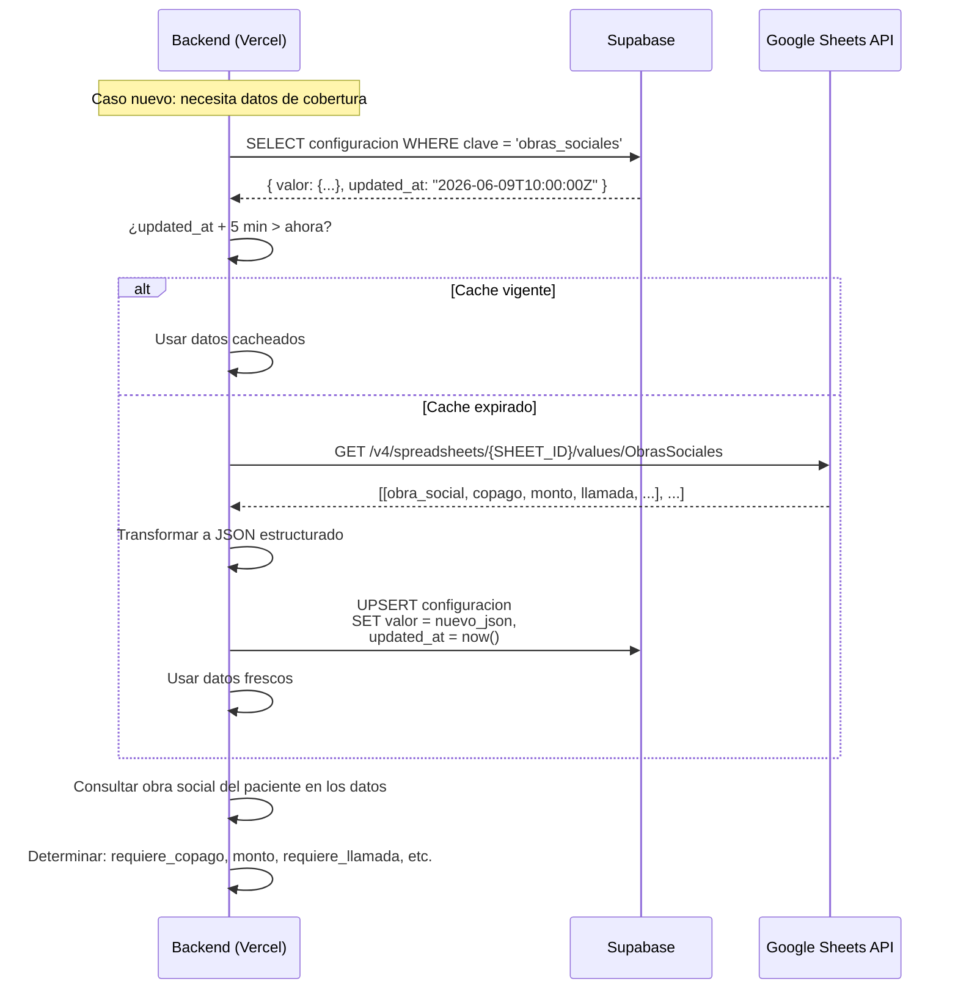

### 7.2 Estructura de la Google Sheet

**Hoja 1: Obras Sociales**

| Obra social | Copago | Monto estimado | Requiere llamada | Requiere autorización | Código FEMEBA | Notas |
|---|---|---|---|---|---|---|
| IOMA | Sí | $500 | No | Sí | Disponible | Token obligatorio |
| OSDE | No | — | No | No | — | — |
| Particular | No | — | No | No | — | Pago en efectivo o transferencia |
| PAMI | Sí | $300 | Sí | Sí | No disponible | Llamar para verificar cobertura |

**Hoja 2: Precios**

| Práctica | Precio transferencia | Precio efectivo |
|---|---|---|
| Ecografía abdominal | $8,000 | $7,000 |
| Mamografía bilateral | $10,000 | $8,500 |
| TAC Cone Beam | $12,000 | $10,000 |
| *Vigencia* | *Junio 2026* | *Junio 2026* |

### 7.3 Reglas de cache

| Parámetro | Valor |
|---|---|
| TTL | 5 minutos |
| Estrategia | Lazy refresh (se refresca al consultar si expiró) |
| Fallback | Si Google Sheets no responde, usar último valor cacheado |
| Alerta | Si no se puede sincronizar por > 30 min, alertar al admin |

---

## 8. Flujo Realtime

### 8.1 Suscripciones y eventos

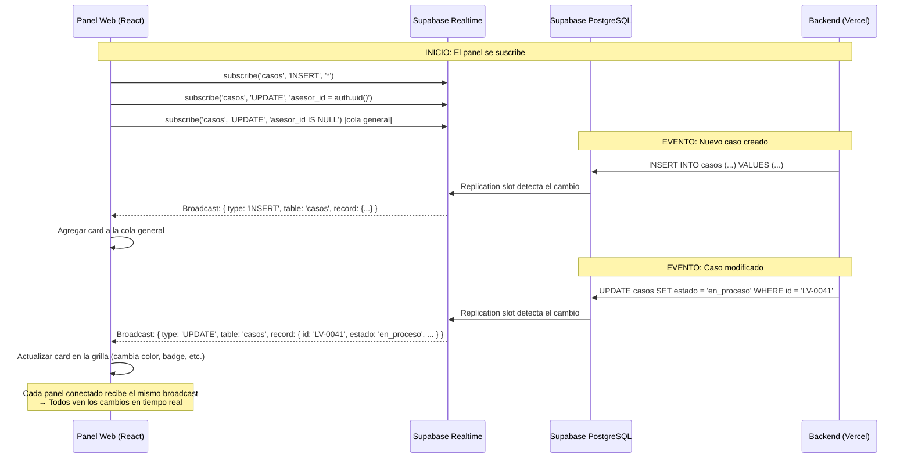

### 8.2 Tipos de eventos Realtime

| Evento | Canal | Acción en el panel |
|---|---|---|
| `casos:INSERT` | `casos` (público) | Agregar card a la cola general |
| `casos:UPDATE` | `casos` (filtrado por asesor) | Actualizar card (estado, prioridad, flags) |
| `casos:DELETE` | `casos` (público) | Remover card (no aplica — soft delete) |
| `extraccion_ia:INSERT` | No suscrito | Solo se lee junto con el caso via REST |

### 8.3 Consideraciones de Realtime

| Aspecto | Detalle |
|---|---|
| **Conexión** | WebSocket persistente desde el frontend a Supabase |
| **Autenticación** | El canal Realtime usa el token JWT de Supabase Auth |
| **Filtrado** | Los filtros se aplican en el frontend (no en la suscripción) para simplificar |
| **Reconexión** | Supabase SDK reconecta automáticamente con backoff exponencial |
| **Payload** | Solo se envía el registro modificado, no la tabla completa |

---

## 9. Autenticación

### 9.1 Flujo de autenticación

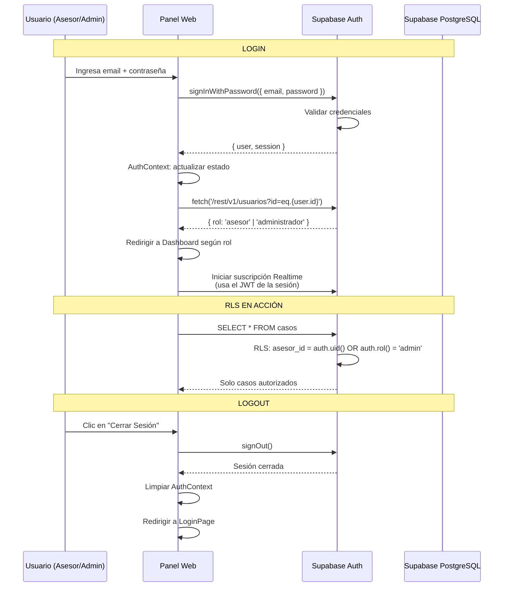

### 9.2 Modelo de roles y permisos

| Rol | Permisos | Tablas accesibles |
|---|---|---|
| **asesor** | Ver casos asignados, tomar casos de cola, resolver casos | `casos` (RLS: asesor_id), `turnos` (RLS: caso.asesor_id) |
| **administrador** | Ver todos los casos, ver métricas, gestionar usuarios, sync Google Sheets | `casos` (todos), `usuarios`, `configuracion` |

### 9.3 RLS (Row Level Security) — Políticas

| Tabla | Operación | Regla de acceso |
|---|---|---|
| `casos` | SELECT | El asesor ve solo casos donde `asesor_id = su_usuario`, más los casos sin asignar. El administrador ve todos los casos |
| `casos` | UPDATE | El asesor modifica solo sus casos asignados (`asesor_id = su_usuario`). El administrador modifica cualquier caso |
| `casos` | INSERT | Cualquier usuario autenticado con rol `asesor` o `administrador` puede insertar casos |
| `turnos` | SELECT / INSERT | Vinculados a casos que el asesor tiene permiso de ver. El administrador ve todos |
| `llamadas` | SELECT / INSERT | Vinculadas a casos que el asesor tiene permiso de ver |
| `extraccion_ia` | SELECT | Vinculada al caso que el asesor tiene permiso de ver |
| `usuarios` | SELECT | Solo el administrador puede listar usuarios (para gestión de equipo) |
| `configuracion` | SELECT | Todos los usuarios autenticados pueden leer configuración |

---

## 10. Gestión de Estados

### 10.1 Máquina de estados de un caso

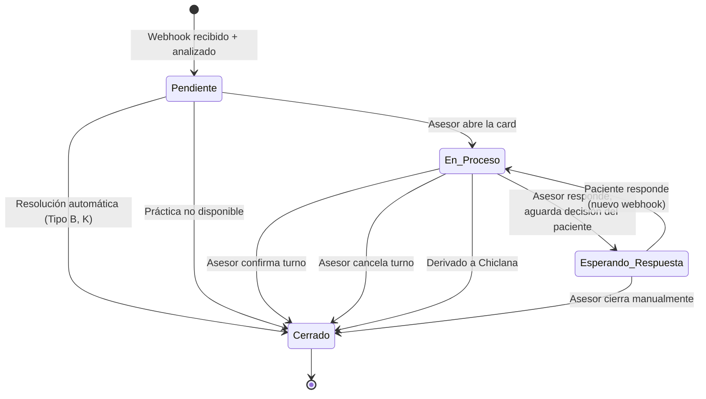

### 10.2 Estados posibles

| Estado | Descripción | Acciones permitidas |
|---|---|---|
| **pendiente** | Caso recién creado, esperando asesor | Asignar, abrir modal, resolver automático |
| **en_proceso** | Asesor está trabajando en el caso | Confirmar turno, llamar, derivar, agregar nota |
| **esperando_respuesta** | Se respondió al paciente, se aguarda decisión | Cerrar, reactivar si paciente responde |
| **cerrado** | Caso resuelto con closing_reason | Solo lectura + historial |

### 10.3 Transiciones de estado por tipo de caso

| Tipo | Transición típica |
|---|---|
| **A** (Turno con orden) | pendiente → en_proceso → cerrado |
| **B** (Automático) | pendiente → cerrado (sin pasar por en_proceso) |
| **C** (Precios) | pendiente → en_proceso → esperando_respuesta → en_proceso → cerrado |
| **D** (Copago) | pendiente → en_proceso → (llamada) → cerrado |
| **E** (Chiclana) | pendiente → en_proceso → cerrado (derivado) |
| **F** (Resultados) | pendiente → en_proceso → esperando_respuesta → cerrado |
| **G** (Médico derivante) | pendiente → en_proceso → cerrado |
| **H** (Punción/biopsia) | pendiente → en_proceso → esperando_respuesta → en_proceso → cerrado |
| **I** (Reprogramación) | pendiente → en_proceso → cerrado |
| **J** (Cancelación) | pendiente → en_proceso → cerrado |
| **K** (Equivocado) | pendiente → cerrado |

### 10.4 Closing reasons (12 valores)

| Closing Reason | Cuándo se usa | ¿Automático? |
|---|---|---|
| **Turno asignado** | Asesor confirmó fecha, hora y sede | No |
| **Turno reprogramado** | Se modificó un turno existente | No |
| **Turno cancelado** | Paciente canceló su turno | Semiautomático |
| **Consulta resuelta** | Consulta general respondida | No |
| **Consulta resuelta Portal Web** | Paciente accedió al portal de resultados | Semiautomático |
| **Esperando respuesta** | Se respondió pero se aguarda decisión | No |
| **Derivado a Chiclana** | Medicina Nuclear derivada | Semiautomático |
| **Práctica no disponible** | Estudio no se realiza en el instituto | ✅ Automático |
| **Equivocado** | Paciente quería contactar otro centro | ✅ Automático |
| **Error de datos en RIS** | DNI u otro dato corregido | No |
| **Presupuesto pendiente** | Presupuesto de punción/biopsia en proceso | No |
| **Sin resolución** | Caso no pudo resolverse | No |

---

## 11. Resumen de Flujos

### Todos los flujos del sistema

| Flujo | Gatillo | Componentes involucrados |
|---|---|---|
| **Flujo Callbell** | Mensaje entrante de paciente | Callbell → Backend (webhook) |
| **Flujo Claude** | Mensaje + adjuntos recibidos | Backend → Claude API → Backend |
| **Flujo Google Sheets** | Necesidad de cobertura o precio | Backend → Supabase cache → Google Sheets API |
| **Flujo Realtime** | Caso creado o actualizado | Supabase DB → Realtime WebSocket → Panel |
| **Flujo Autenticación** | Login del asesor | Panel → Supabase Auth → RLS en DB |
| **Flujo Resolución** | Asesor confirma acción | Panel → Backend → Callbell API → WhatsApp |
| **Flujo Automático (Tipo B)** | Práctica sin turno previo | Backend → Callbell API → WhatsApp (sin card) |
| **Flujo Derivación (Tipo E)** | Práctica de Medicina Nuclear | Backend → Callbell API → Chiclana WhatsApp |

---

## 12. Fuera de Alcance (v1)

- ❌ Integración directa con el RIS IT SOS
- ❌ Recordatorios automáticos pre-turno por WhatsApp
- ❌ Portal médico para médicos derivantes
- ❌ Módulo de facturación a obras sociales
- ❌ App móvil para asesores
- ❌ Integración con GAMA Laboratorios
- ❌ Escalado a otros centros de diagnóstico
